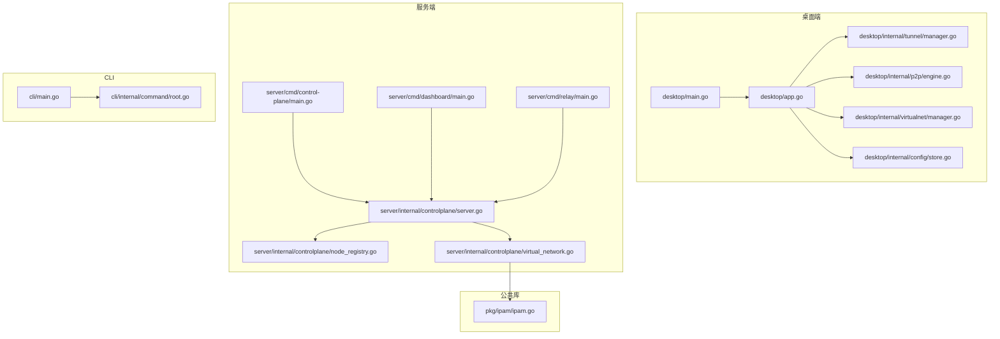
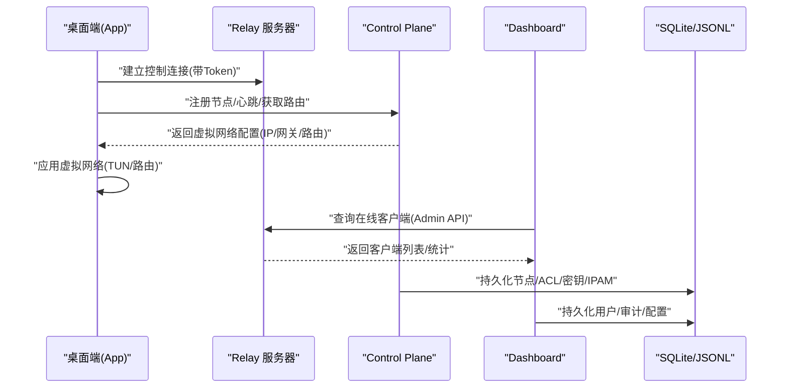
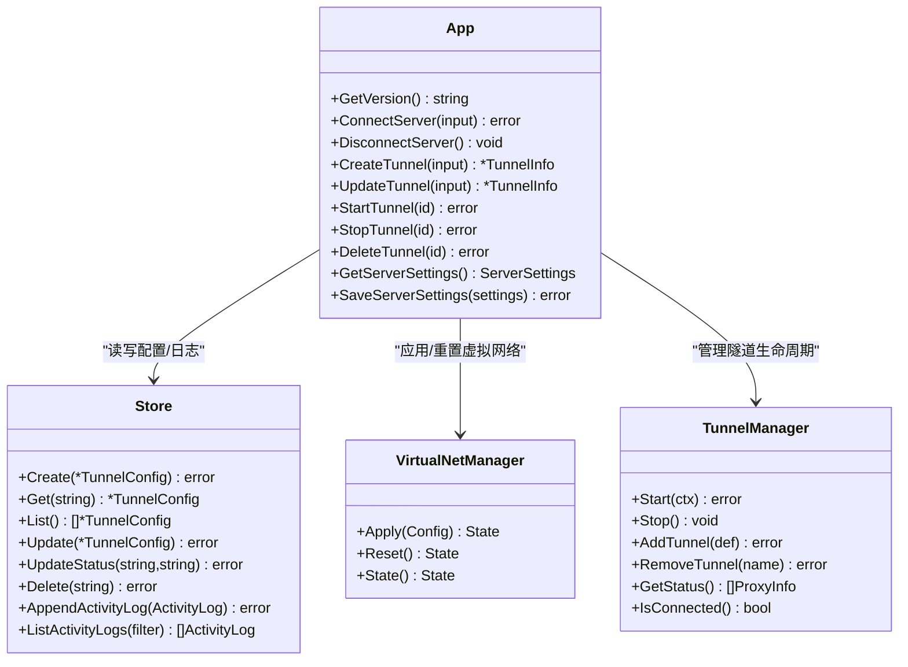
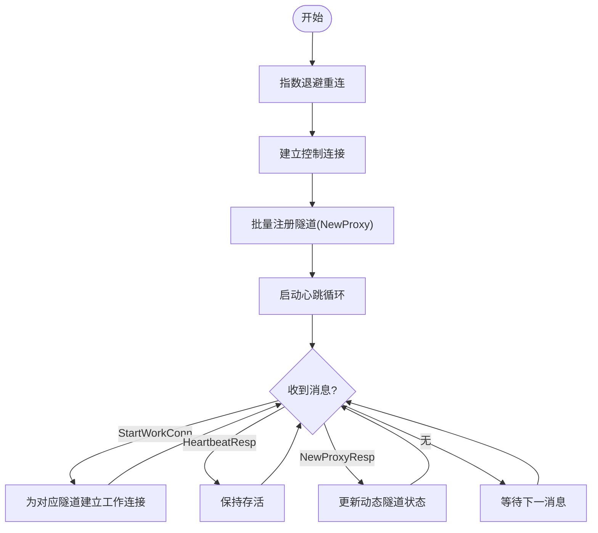
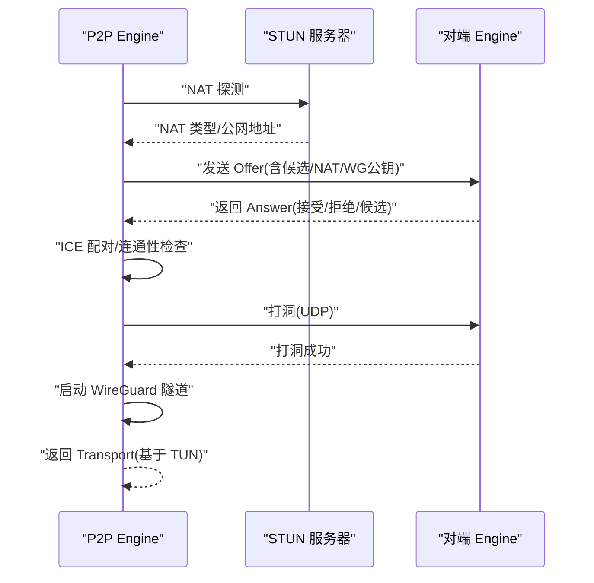
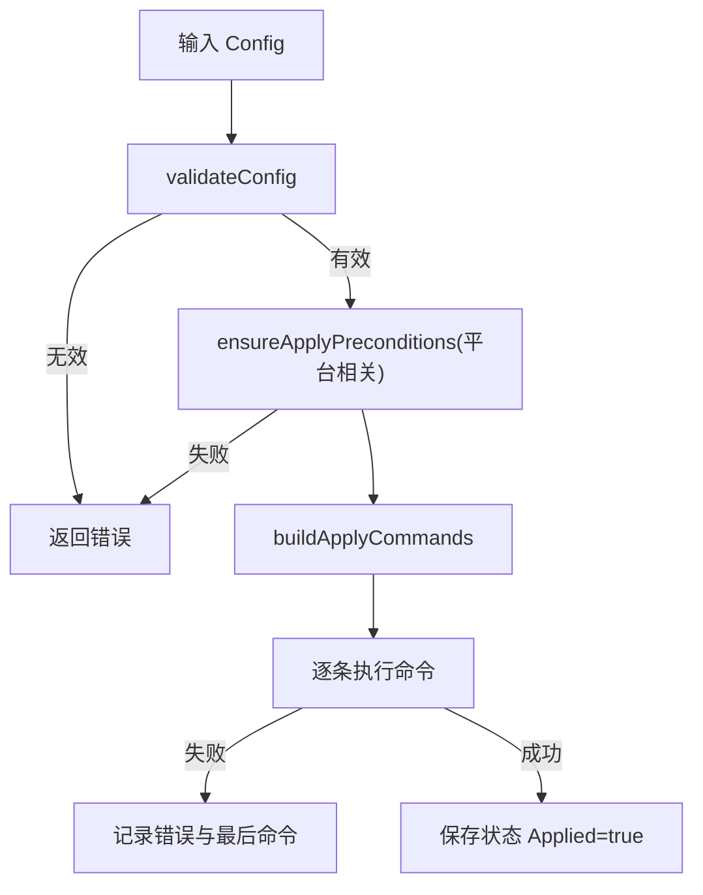
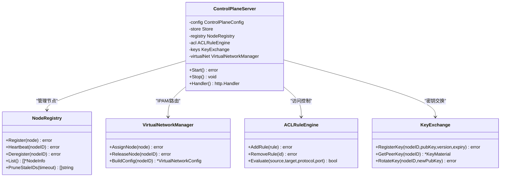
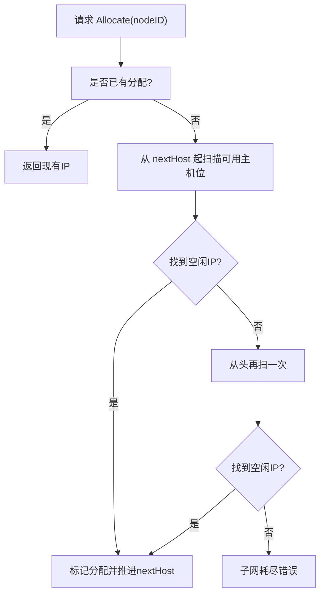
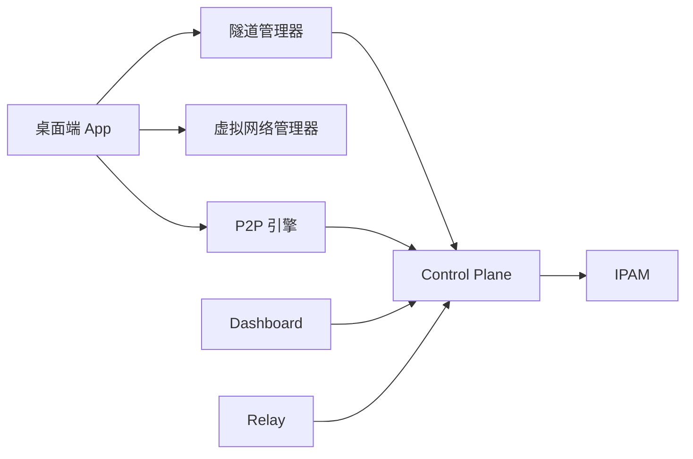

# 虚拟网络管理系统

<cite>
**本文引用的文件**   
- [README.md](file://README.md)
- [desktop/main.go](file://desktop/main.go)
- [desktop/app.go](file://desktop/app.go)
- [desktop/internal/config/store.go](file://desktop/internal/config/store.go)
- [desktop/internal/tunnel/manager.go](file://desktop/internal/tunnel/manager.go)
- [desktop/internal/p2p/engine.go](file://desktop/internal/p2p/engine.go)
- [desktop/internal/virtualnet/manager.go](file://desktop/internal/virtualnet/manager.go)
- [server/cmd/control-plane/main.go](file://server/cmd/control-plane/main.go)
- [server/internal/controlplane/server.go](file://server/internal/controlplane/server.go)
- [server/internal/controlplane/node_registry.go](file://server/internal/controlplane/node_registry.go)
- [server/internal/controlplane/virtual_network.go](file://server/internal/controlplane/virtual_network.go)
- [pkg/ipam/ipam.go](file://pkg/ipam/ipam.go)
- [server/cmd/dashboard/main.go](file://server/cmd/dashboard/main.go)
- [server/cmd/relay/main.go](file://server/cmd/relay/main.go)
- [cli/main.go](file://cli/main.go)
- [cli/internal/command/root.go](file://cli/internal/command/root.go)
</cite>

## 目录
1. [简介](#简介)
2. [项目结构](#项目结构)
3. [核心组件](#核心组件)
4. [架构总览](#架构总览)
5. [详细组件分析](#详细组件分析)
6. [依赖关系分析](#依赖关系分析)
7. [性能与可扩展性](#性能与可扩展性)
8. [故障排查指南](#故障排查指南)
9. [结论](#结论)
10. [附录](#附录)

## 简介
NexTunnel 是一套开源的内网穿透、P2P 直连优先与可视化运维工具，提供桌面客户端、统一 CLI、Relay 中继、Control Plane（控制面）、Dashboard（管理面板）以及 NAT/STUN 探测和生产验证脚本。其目标是像传统内网穿透方案一样快速暴露本地服务，同时提供更明确的桌面体验、服务端可观测性、P2P/TUN 诊断和发布前生产验收路径。

本仓库采用多模块 Go 工程组织，前端基于 Wails + Vue，后端由多个独立进程组成：Relay、Control Plane、Dashboard、NAT Detector 等，通过 HTTP/QUIC/TCP 协议交互，支持 mTLS 或 Bearer Token 认证，具备节点注册、心跳、路由/IPAM、ACL、密钥交换与审计能力。

## 项目结构
整体按“功能域”划分：
- desktop：桌面端应用（Wails + Vue），负责连接 Relay/Control Plane、隧道生命周期、虚拟网络配置、P2P/NAT 探测、活动日志与常用端口管理等。
- server：服务端各子进程入口与内部实现，包括 control-plane、dashboard、relay、nat-detector 等。
- cli：统一命令行工具，封装对 Control Plane、Dashboard 和本机桌面端的操作。
- pkg：跨模块共享库，如 IPAM、协议编解码、审计、TLS 工具等。
- deploy/scripts/docs：部署、打包与文档。

图表来源
- [desktop/main.go:1-45](file://desktop/main.go#L1-L45)
- [desktop/app.go:1-200](file://desktop/app.go#L1-L200)
- [desktop/internal/tunnel/manager.go:1-120](file://desktop/internal/tunnel/manager.go#L1-L120)
- [desktop/internal/p2p/engine.go:1-120](file://desktop/internal/p2p/engine.go#L1-L120)
- [desktop/internal/virtualnet/manager.go:1-120](file://desktop/internal/virtualnet/manager.go#L1-L120)
- [desktop/internal/config/store.go:1-120](file://desktop/internal/config/store.go#L1-L120)
- [server/cmd/control-plane/main.go:1-74](file://server/cmd/control-plane/main.go#L1-L74)
- [server/internal/controlplane/server.go:1-120](file://server/internal/controlplane/server.go#L1-L120)
- [server/internal/controlplane/node_registry.go:1-120](file://server/internal/controlplane/node_registry.go#L1-L120)
- [server/internal/controlplane/virtual_network.go:1-120](file://server/internal/controlplane/virtual_network.go#L1-L120)
- [pkg/ipam/ipam.go:1-120](file://pkg/ipam/ipam.go#L1-L120)
- [server/cmd/dashboard/main.go:1-113](file://server/cmd/dashboard/main.go#L1-L113)
- [server/cmd/relay/main.go:1-87](file://server/cmd/relay/main.go#L1-L87)
- [cli/main.go:1-19](file://cli/main.go#L1-L19)
- [cli/internal/command/root.go:1-45](file://cli/internal/command/root.go#L1-L45)

章节来源
- [README.md:1-120](file://README.md#L1-L120)

## 核心组件
- 桌面端 App（Wails 绑定）：负责启动/停止隧道、连接/断开 Relay、保存/读取配置、记录活动日志、虚拟网络应用/回滚、NAT 探测与 P2P 状态展示。
- 隧道管理器（Client Manager）：维护与 Relay 的长连接、自动重连、心跳、动态增删隧道、消息分发与状态同步。
- P2P 引擎：完成 NAT 探测、ICE 候选收集与配对、打洞、WireGuard 隧道建立，并对外暴露 Transport 接口供上层使用。
- 虚拟网络管理器（桌面端）：根据 Control Plane 下发的虚拟网络配置，在本地执行系统命令创建 TUN 接口、设置 IP/MTU/路由，并提供 Reset 回滚。
- 控制面 Server：提供节点注册/心跳/删除、Peer 列表、路由/IPAM、ACL、密钥交换、审计查询；支持 mTLS 或 Bearer Token 鉴权。
- 节点注册表与 ACL/密钥交换：内存+持久化双写，支持过期清理与默认拒绝策略。
- IPAM：基于 CIDR 的子网地址分配器，支持保留/释放/恢复。
- Dashboard：Web 管理界面，提供登录、RBAC、客户端监控、ACL、告警、审计与配置状态查看。
- Relay：TCP/QUIC 代理转发，Admin API 用于在线客户端管理与统计。
- CLI：统一入口，封装版本、配置、远端（Control Plane/Dashboard）与本机桌面端操作。

章节来源
- [desktop/app.go:100-200](file://desktop/app.go#L100-L200)
- [desktop/internal/tunnel/manager.go:20-120](file://desktop/internal/tunnel/manager.go#L20-L120)
- [desktop/internal/p2p/engine.go:70-150](file://desktop/internal/p2p/engine.go#L70-L150)
- [desktop/internal/virtualnet/manager.go:18-92](file://desktop/internal/virtualnet/manager.go#L18-L92)
- [server/internal/controlplane/server.go:19-120](file://server/internal/controlplane/server.go#L19-L120)
- [server/internal/controlplane/node_registry.go:10-120](file://server/internal/controlplane/node_registry.go#L10-L120)
- [server/internal/controlplane/virtual_network.go:28-120](file://server/internal/controlplane/virtual_network.go#L28-L120)
- [pkg/ipam/ipam.go:20-120](file://pkg/ipam/ipam.go#L20-L120)
- [server/cmd/dashboard/main.go:25-113](file://server/cmd/dashboard/main.go#L25-L113)
- [server/cmd/relay/main.go:15-87](file://server/cmd/relay/main.go#L15-L87)
- [cli/main.go:10-19](file://cli/main.go#L10-L19)
- [cli/internal/command/root.go:10-45](file://cli/internal/command/root.go#L10-L45)

## 架构总览
下图展示了端到端数据与控制流：桌面端通过 Relay 进行隧道转发，通过 Control Plane 完成节点注册、心跳、路由/IPAM 下发；Dashboard 通过 Relay Admin API 获取在线客户端信息；Control Plane 可选启用 mTLS 或 Bearer Token 鉴权。

图表来源
- [desktop/app.go:676-727](file://desktop/app.go#L676-L727)
- [desktop/internal/tunnel/manager.go:108-154](file://desktop/internal/tunnel/manager.go#L108-L154)
- [server/internal/controlplane/server.go:138-154](file://server/internal/controlplane/server.go#L138-L154)
- [server/internal/controlplane/virtual_network.go:103-140](file://server/internal/controlplane/virtual_network.go#L103-L140)
- [server/cmd/dashboard/main.go:71-98](file://server/cmd/dashboard/main.go#L71-L98)
- [server/cmd/relay/main.go:32-87](file://server/cmd/relay/main.go#L32-L87)

## 详细组件分析

### 桌面端应用（Wails 绑定）
- 职责：初始化数据库与配置存储、启动控制 API、加载隧道管理器、虚拟网络管理器；提供 GetVersion/Greet 等示例绑定方法；集中处理连接/断开、隧道 CRUD、运行态与活动日志。
- 关键流程：
  - 启动时打开 SQLite 配置库，构造 Store 与 VirtualNetwork Manager，构建 Tunnel Manager 并启动本地控制 API。
  - ConnectServer 更新持久化设置，创建新的 Tunnel Manager 并后台启动连接循环。
  - StartTunnel/StopTunnel 动态增删运行时隧道，并更新持久化状态。
  - 虚拟网络 Apply/Reset 调用平台命令执行器，Windows 下会检查适配器就绪。

图表来源
- [desktop/app.go:116-153](file://desktop/app.go#L116-L153)
- [desktop/app.go:676-727](file://desktop/app.go#L676-L727)
- [desktop/internal/config/store.go:76-182](file://desktop/internal/config/store.go#L76-L182)
- [desktop/internal/virtualnet/manager.go:48-125](file://desktop/internal/virtualnet/manager.go#L48-L125)
- [desktop/internal/tunnel/manager.go:108-154](file://desktop/internal/tunnel/manager.go#L108-L154)

章节来源
- [desktop/main.go:16-44](file://desktop/main.go#L16-L44)
- [desktop/app.go:116-153](file://desktop/app.go#L116-L153)
- [desktop/app.go:676-727](file://desktop/app.go#L676-L727)
- [desktop/internal/config/store.go:76-182](file://desktop/internal/config/store.go#L76-L182)
- [desktop/internal/virtualnet/manager.go:48-125](file://desktop/internal/virtualnet/manager.go#L48-L125)

### 隧道管理器（Client Manager）
- 职责：与 Relay 建立控制连接，自动重连与心跳；注册/注销隧道；处理服务器消息（工作连接、心跳响应、动态隧道注册结果）。
- 关键流程：
  - Start 使用指数退避重连；connectAndRun 完成单次连接、注册所有隧道、心跳循环与消息分发。
  - registerAllTunnels 发送 NewProxy 并等待 NewProxyResp，成功后更新远程端口与活跃状态。
  - AddTunnel/RemoveTunnel 支持运行时动态增删，若已连接则立即通知服务器。

图表来源
- [desktop/internal/tunnel/manager.go:108-154](file://desktop/internal/tunnel/manager.go#L108-L154)
- [desktop/internal/tunnel/manager.go:156-198](file://desktop/internal/tunnel/manager.go#L156-L198)
- [desktop/internal/tunnel/manager.go:200-260](file://desktop/internal/tunnel/manager.go#L200-L260)
- [desktop/internal/tunnel/manager.go:298-354](file://desktop/internal/tunnel/manager.go#L298-L354)

章节来源
- [desktop/internal/tunnel/manager.go:24-120](file://desktop/internal/tunnel/manager.go#L24-L120)
- [desktop/internal/tunnel/manager.go:108-154](file://desktop/internal/tunnel/manager.go#L108-L154)
- [desktop/internal/tunnel/manager.go:156-198](file://desktop/internal/tunnel/manager.go#L156-L198)
- [desktop/internal/tunnel/manager.go:200-260](file://desktop/internal/tunnel/manager.go#L200-L260)
- [desktop/internal/tunnel/manager.go:298-354](file://desktop/internal/tunnel/manager.go#L298-L354)

### P2P 引擎（NAT 探测/ICE/打洞/WireGuard）
- 职责：NAT 类型探测、ICE 候选收集与配对、打洞、建立 WireGuard 隧道，对外暴露 Transport 接口。
- 关键流程：
  - DetectNAT 缓存 NAT 结果；InitiateP2P/HandleP2POffer/HandleP2PAnswer 分别作为发起方与应答方完成握手与连通性检测。
  - 选择 ICE Pair 后进入打洞阶段，成功后启动 WireGuard 隧道，封装为 p2pTransport 供上层使用。

图表来源
- [desktop/internal/p2p/engine.go:154-170](file://desktop/internal/p2p/engine.go#L154-L170)
- [desktop/internal/p2p/engine.go:172-219](file://desktop/internal/p2p/engine.go#L172-L219)
- [desktop/internal/p2p/engine.go:221-323](file://desktop/internal/p2p/engine.go#L221-L323)
- [desktop/internal/p2p/engine.go:325-399](file://desktop/internal/p2p/engine.go#L325-L399)

章节来源
- [desktop/internal/p2p/engine.go:70-150](file://desktop/internal/p2p/engine.go#L70-L150)
- [desktop/internal/p2p/engine.go:154-170](file://desktop/internal/p2p/engine.go#L154-L170)
- [desktop/internal/p2p/engine.go:172-219](file://desktop/internal/p2p/engine.go#L172-L219)
- [desktop/internal/p2p/engine.go:221-323](file://desktop/internal/p2p/engine.go#L221-L323)
- [desktop/internal/p2p/engine.go:325-399](file://desktop/internal/p2p/engine.go#L325-L399)

### 虚拟网络管理器（桌面端）
- 职责：校验配置、预检（Windows 下检查适配器就绪）、生成并执行系统命令以应用/重置虚拟网络（TUN/路由/MTU），维护当前状态。
- 关键点：
  - validateConfig 严格校验节点ID、虚拟IP、子网、网关、接口名、MTU 与路由条目。
  - ensureApplyPreconditions 针对 Windows 做适配器存在性轮询检查。
  - Apply/Reset 顺序执行命令，失败时记录最后执行的命令与错误。

图表来源
- [desktop/internal/virtualnet/manager.go:48-92](file://desktop/internal/virtualnet/manager.go#L48-L92)
- [desktop/internal/virtualnet/manager.go:127-132](file://desktop/internal/virtualnet/manager.go#L127-L132)
- [desktop/internal/virtualnet/manager.go:134-179](file://desktop/internal/virtualnet/manager.go#L134-L179)

章节来源
- [desktop/internal/virtualnet/manager.go:18-92](file://desktop/internal/virtualnet/manager.go#L18-L92)
- [desktop/internal/virtualnet/manager.go:127-132](file://desktop/internal/virtualnet/manager.go#L127-L132)
- [desktop/internal/virtualnet/manager.go:134-179](file://desktop/internal/virtualnet/manager.go#L134-L179)

### 控制面（Control Plane）
- 职责：HTTP API 提供节点注册/心跳/删除、Peer 列表、路由/IPAM、ACL、密钥交换、审计查询；支持 mTLS 或 Bearer Token 鉴权；后台定时清理过期节点。
- 关键流程：
  - authMiddleware 优先从 TLS 证书 CN 提取身份，否则回退到 Bearer Token。
  - handleRegisterNode 在启用 IPAM 时为节点分配虚拟 IP，注册成功后写入审计。
  - handleGetNodeRoutes 返回虚拟网络配置（IP/网关/接口/MTU/路由）。
  - pruneLoop 定期清理未心跳的节点并释放虚拟 IP。

图表来源
- [server/internal/controlplane/server.go:19-120](file://server/internal/controlplane/server.go#L19-L120)
- [server/internal/controlplane/server.go:138-154](file://server/internal/controlplane/server.go#L138-L154)
- [server/internal/controlplane/server.go:156-191](file://server/internal/controlplane/server.go#L156-L191)
- [server/internal/controlplane/server.go:197-222](file://server/internal/controlplane/server.go#L197-L222)
- [server/internal/controlplane/server.go:262-273](file://server/internal/controlplane/server.go#L262-L273)
- [server/internal/controlplane/server.go:420-443](file://server/internal/controlplane/server.go#L420-L443)
- [server/internal/controlplane/node_registry.go:44-132](file://server/internal/controlplane/node_registry.go#L44-L132)
- [server/internal/controlplane/virtual_network.go:61-140](file://server/internal/controlplane/virtual_network.go#L61-L140)

章节来源
- [server/cmd/control-plane/main.go:15-74](file://server/cmd/control-plane/main.go#L15-L74)
- [server/internal/controlplane/server.go:19-120](file://server/internal/controlplane/server.go#L19-L120)
- [server/internal/controlplane/server.go:138-154](file://server/internal/controlplane/server.go#L138-L154)
- [server/internal/controlplane/server.go:156-191](file://server/internal/controlplane/server.go#L156-L191)
- [server/internal/controlplane/server.go:197-222](file://server/internal/controlplane/server.go#L197-L222)
- [server/internal/controlplane/server.go:262-273](file://server/internal/controlplane/server.go#L262-L273)
- [server/internal/controlplane/server.go:420-443](file://server/internal/controlplane/server.go#L420-L443)
- [server/internal/controlplane/node_registry.go:44-132](file://server/internal/controlplane/node_registry.go#L44-L132)
- [server/internal/controlplane/virtual_network.go:61-140](file://server/internal/controlplane/virtual_network.go#L61-L140)

### IPAM（虚拟网络地址分配）
- 职责：在给定 CIDR 中为节点分配 IPv4，预留网关/网络/广播地址，支持 Reserve/Release/List。
- 复杂度：Allocate 线性扫描可用主机位，最坏 O(N)，N 为已分配数量；Reserve 校验冲突 O(N)。

图表来源
- [pkg/ipam/ipam.go:71-118](file://pkg/ipam/ipam.go#L71-L118)
- [pkg/ipam/ipam.go:120-155](file://pkg/ipam/ipam.go#L120-L155)

章节来源
- [pkg/ipam/ipam.go:20-120](file://pkg/ipam/ipam.go#L20-L120)
- [pkg/ipam/ipam.go:71-118](file://pkg/ipam/ipam.go#L71-L118)
- [pkg/ipam/ipam.go:120-155](file://pkg/ipam/ipam.go#L120-L155)

### Dashboard 与 Relay
- Dashboard：解析参数、初始化存储（SQLite/内存）、启动 HTTP 服务，监听 8080，支持 HTTPS、CORS、审计日志与 Relay Admin API 集成。
- Relay：解析参数、校验安全基线（非 localhost 需 Token）、启动 TCP/QUIC 服务，周期性打印统计，优雅关闭。

章节来源
- [server/cmd/dashboard/main.go:25-113](file://server/cmd/dashboard/main.go#L25-L113)
- [server/cmd/relay/main.go:15-87](file://server/cmd/relay/main.go#L15-L87)

### CLI
- 统一入口，提供 version、config、server、remote、desktop、doctor 等子命令，输出格式支持 table/json。

章节来源
- [cli/main.go:10-19](file://cli/main.go#L10-L19)
- [cli/internal/command/root.go:10-45](file://cli/internal/command/root.go#L10-L45)

## 依赖关系分析
- 组件耦合：
  - 桌面端 App 依赖隧道管理器、虚拟网络管理器与配置存储，松耦合通过接口注入（如 P2PEngine、WorkConnOpener）。
  - 控制面 Server 组合 NodeRegistry、ACLRuleEngine、KeyExchange、VirtualNetworkManager，并通过 Store 抽象持久化。
  - IPAM 被 VirtualNetworkManager 使用，提供子网地址分配。
- 外部依赖：
  - 桌面端依赖 Wails 框架与系统命令执行器（Windows/macOS/Linux 差异）。
  - 控制面与 Dashboard 使用 SQLite/JSONL 持久化。
  - P2P 依赖 STUN 与 ICE/WireGuard。
- 潜在循环依赖：
  - 通过窄接口（PathManager/RelaySelector/MigrationController）解耦 P2P 引擎与调度/迁移逻辑，避免循环导入。

图表来源
- [desktop/app.go:100-153](file://desktop/app.go#L100-L153)
- [desktop/internal/tunnel/manager.go:24-84](file://desktop/internal/tunnel/manager.go#L24-L84)
- [desktop/internal/p2p/engine.go:70-120](file://desktop/internal/p2p/engine.go#L70-L120)
- [server/internal/controlplane/server.go:19-78](file://server/internal/controlplane/server.go#L19-L78)
- [server/internal/controlplane/virtual_network.go:28-59](file://server/internal/controlplane/virtual_network.go#L28-L59)
- [pkg/ipam/ipam.go:20-69](file://pkg/ipam/ipam.go#L20-L69)
- [server/cmd/dashboard/main.go:71-98](file://server/cmd/dashboard/main.go#L71-L98)
- [server/cmd/relay/main.go:32-87](file://server/cmd/relay/main.go#L32-L87)

章节来源
- [desktop/app.go:100-153](file://desktop/app.go#L100-L153)
- [desktop/internal/tunnel/manager.go:24-84](file://desktop/internal/tunnel/manager.go#L24-L84)
- [desktop/internal/p2p/engine.go:70-120](file://desktop/internal/p2p/engine.go#L70-L120)
- [server/internal/controlplane/server.go:19-78](file://server/internal/controlplane/server.go#L19-L78)
- [server/internal/controlplane/virtual_network.go:28-59](file://server/internal/controlplane/virtual_network.go#L28-L59)
- [pkg/ipam/ipam.go:20-69](file://pkg/ipam/ipam.go#L20-L69)
- [server/cmd/dashboard/main.go:71-98](file://server/cmd/dashboard/main.go#L71-L98)
- [server/cmd/relay/main.go:32-87](file://server/cmd/relay/main.go#L32-L87)

## 性能与可扩展性
- 重连与心跳：
  - 指数退避重连（BaseDelay/MaxDelay/Multiplier/Jitter）降低雪崩风险；心跳间隔可配，保障存活检测。
- 并发与锁：
  - 隧道管理器使用 RWMutex 保护隧道映射；IPAM 使用互斥锁保证分配一致性。
- I/O 与持久化：
  - 配置存储使用 SQLite，批量设置使用事务减少写锁竞争；审计日志 JSONL 追加写入。
- 扩展点：
  - P2P 引擎通过 PathManager/RelaySelector/MigrationController 接口接入智能链路调度、Relay 降级与网络切换控制器。
  - WorkConnOpener 支持替换传输层（如 QUIC），便于未来多传输策略。

[本节为通用指导，不直接分析具体文件]

## 故障排查指南
- 连接问题：
  - 确认 Relay 地址与 Token 正确；桌面端 ConnectServer 会持久化设置并后台启动连接循环。
  - 查看活动日志（AppendActivityLog/ListActivityLogs）定位错误上下文。
- 虚拟网络应用失败：
  - Windows 下确保 wintun.dll 匹配架构并以管理员身份运行；虚拟网络管理器会在应用前检查接口是否存在。
  - 检查虚拟 IP/子网/网关/接口名/MTU 是否符合规范。
- 控制面鉴权：
  - 若启用 mTLS，需配置 CA/Cert/Key；否则使用 Bearer Token；健康检查 /healthz 无需鉴权。
- Dashboard 访问：
  - 确认 CORS 白名单、Secret Key 与管理员密码；建议通过反向代理提供 HTTPS。
- Relay 统计与关闭：
  - 周期性统计日志包含客户端/代理/会话/流量；优雅关闭等待上下文超时。

章节来源
- [desktop/app.go:676-727](file://desktop/app.go#L676-L727)
- [desktop/internal/config/store.go:312-404](file://desktop/internal/config/store.go#L312-L404)
- [desktop/internal/virtualnet/manager.go:127-199](file://desktop/internal/virtualnet/manager.go#L127-L199)
- [server/internal/controlplane/server.go:156-191](file://server/internal/controlplane/server.go#L156-L191)
- [server/cmd/dashboard/main.go:25-113](file://server/cmd/dashboard/main.go#L25-L113)
- [server/cmd/relay/main.go:39-87](file://server/cmd/relay/main.go#L39-L87)

## 结论
NexTunnel 将桌面端、控制面、中继与管理面板有机整合，形成“P2P 直连优先 + 可靠中继兜底”的虚拟网络体系。通过严格的配置校验、健壮的鉴权机制、完善的审计与可观测性，满足开发与生产环境的多场景需求。未来可在智能链路调度、多传输策略与 eBPF 加速等方面持续演进。

[本节为总结，不直接分析具体文件]

## 附录
- 快速开始与部署参考：见 README 中的安装与服务端进程参数说明。
- 公开管理接口：Relay Admin API、Dashboard API、Control Plane API 详见 README 表格。

章节来源
- [README.md:251-331](file://README.md#L251-L331)