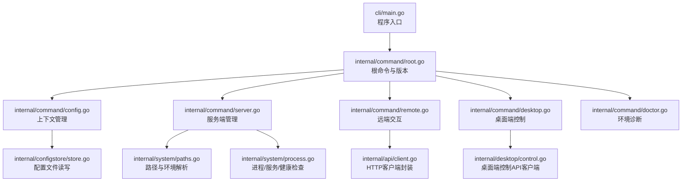
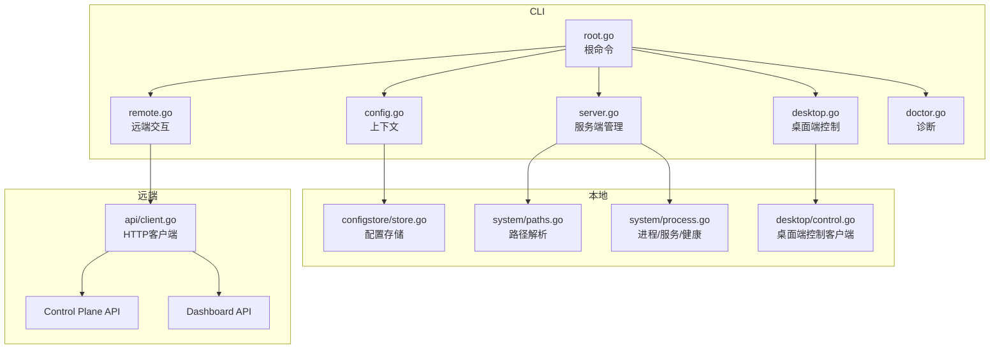
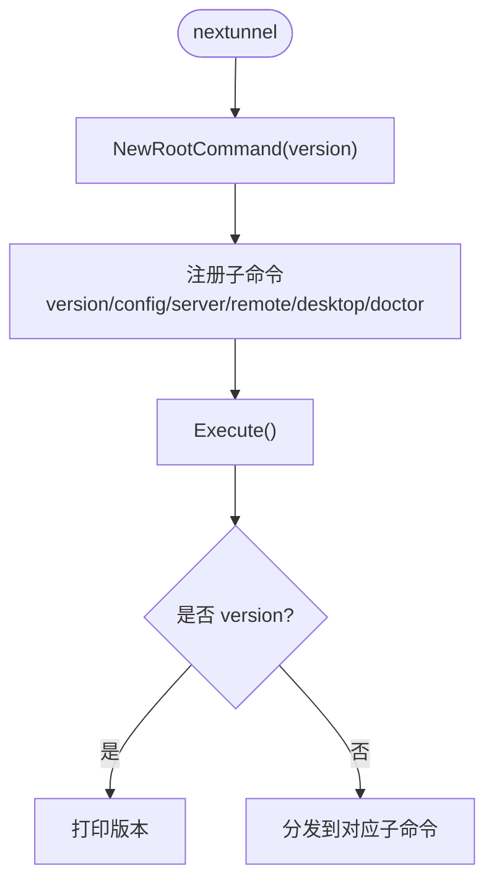
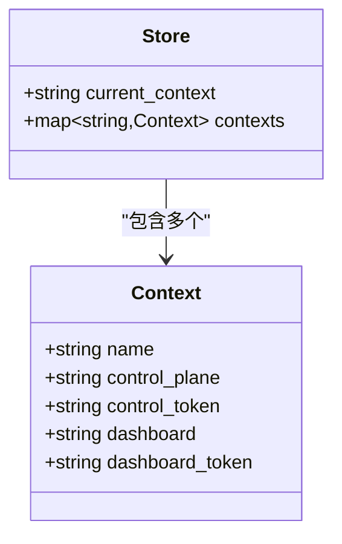
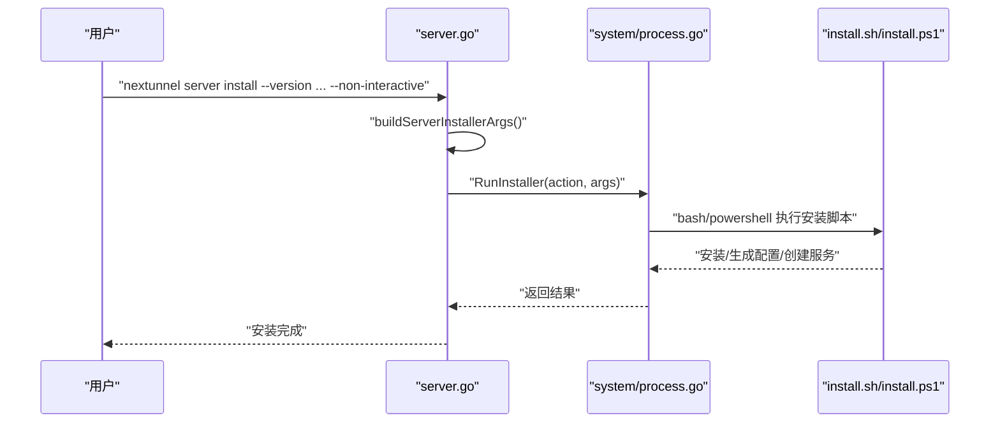
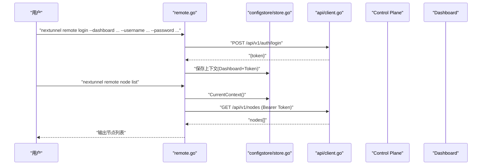
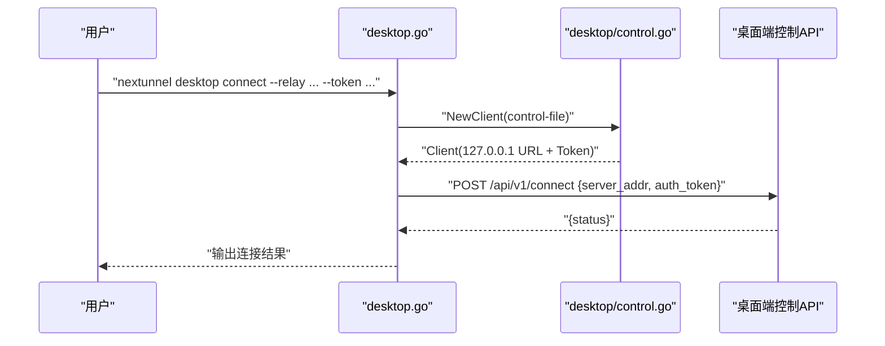
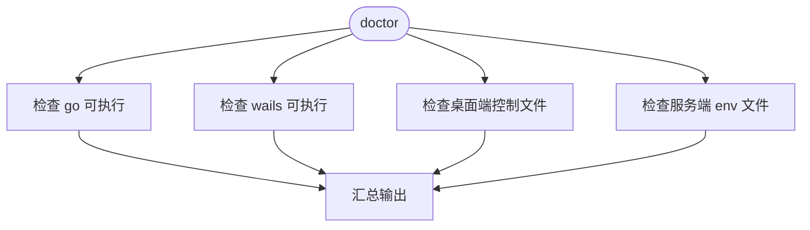
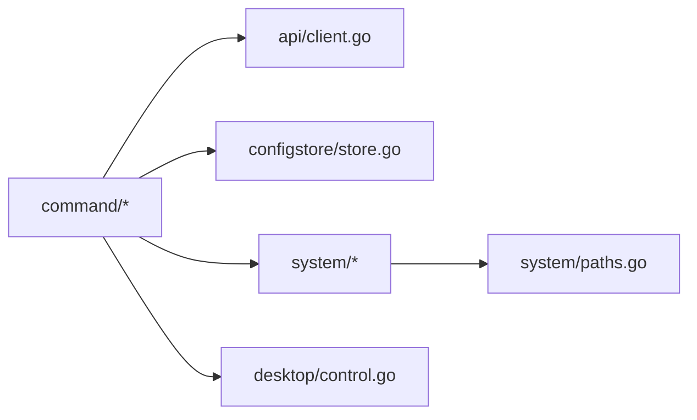

# 命令行工具

<cite>
**本文引用的文件**   
- [cli/main.go](file://cli/main.go)
- [cli/internal/command/root.go](file://cli/internal/command/root.go)
- [cli/internal/command/config.go](file://cli/internal/command/config.go)
- [cli/internal/command/server.go](file://cli/internal/command/server.go)
- [cli/internal/command/remote.go](file://cli/internal/command/remote.go)
- [cli/internal/command/desktop.go](file://cli/internal/command/desktop.go)
- [cli/internal/command/doctor.go](file://cli/internal/command/doctor.go)
- [cli/internal/command/output.go](file://cli/internal/command/output.go)
- [cli/internal/api/client.go](file://cli/internal/api/client.go)
- [cli/internal/configstore/store.go](file://cli/internal/configstore/store.go)
- [cli/internal/system/paths.go](file://cli/internal/system/paths.go)
- [cli/internal/system/process.go](file://cli/internal/system/process.go)
- [cli/internal/desktop/control.go](file://cli/internal/desktop/control.go)
</cite>

## 目录
1. [简介](#简介)
2. [项目结构](#项目结构)
3. [核心组件](#核心组件)
4. [架构总览](#架构总览)
5. [详细组件分析](#详细组件分析)
6. [依赖关系分析](#依赖关系分析)
7. [性能与可靠性](#性能与可靠性)
8. [故障排查指南](#故障排查指南)
9. [结论](#结论)
10. [附录：命令速查](#附录命令速查)

## 简介
NexTunnel 命令行工具 nextunnel 提供统一的本地与远端管理能力，覆盖服务端安装/启停、上下文配置、远程节点与告警查询、本机桌面端控制与环境诊断等。CLI 基于 Cobra 构建，采用“根命令 + 子命令”的层次化设计，并通过输出格式统一（table/json）便于脚本化使用。

## 项目结构
CLI 模块位于 cli 目录，入口为 main.go，内部按功能划分为 command、api、configstore、system、desktop 等包。根命令负责注册子命令与全局选项；各子命令分别实现具体能力。

图表来源
- [cli/main.go:1-19](file://cli/main.go#L1-L19)
- [cli/internal/command/root.go:10-29](file://cli/internal/command/root.go#L10-L29)
- [cli/internal/command/config.go:10-23](file://cli/internal/command/config.go#L10-L23)
- [cli/internal/command/server.go:11-38](file://cli/internal/command/server.go#L11-L38)
- [cli/internal/command/remote.go:12-25](file://cli/internal/command/remote.go#L12-L25)
- [cli/internal/command/desktop.go:12-29](file://cli/internal/command/desktop.go#L12-L29)
- [cli/internal/command/doctor.go:19-33](file://cli/internal/command/doctor.go#L19-L33)
- [cli/internal/configstore/store.go:22-26](file://cli/internal/configstore/store.go#L22-L26)
- [cli/internal/api/client.go:16-37](file://cli/internal/api/client.go#L16-L37)
- [cli/internal/desktop/control.go:17-26](file://cli/internal/desktop/control.go#L17-L26)
- [cli/internal/system/paths.go:17-25](file://cli/internal/system/paths.go#L17-L25)
- [cli/internal/system/process.go:34-56](file://cli/internal/system/process.go#L34-L56)

章节来源
- [cli/main.go:1-19](file://cli/main.go#L1-L19)
- [cli/internal/command/root.go:10-29](file://cli/internal/command/root.go#L10-L29)

## 核心组件
- 根命令与版本
  - 定义全局输出格式选项，注册 version、config、server、remote、desktop、doctor 子命令。
- 配置上下文
  - 支持设置/切换/查看当前上下文，持久化到用户级配置文件。
- 服务端管理
  - 通过系统安装脚本完成安装/更新/卸载，并封装 up/down/restart/status/health/logs/paths 等操作。
- 远端交互
  - 登录 Dashboard 保存 token，调用 Control Plane/Dashboard API 获取节点、ACL、告警等信息。
- 桌面端控制
  - 读取本地控制文件，调用桌面端控制 API 进行连接/断开/NAT检测/网络路由/设置管理等。
- 环境诊断
  - 检查 go/wails 可执行、桌面端控制文件与服务端 env 文件是否存在及权限。

章节来源
- [cli/internal/command/root.go:10-29](file://cli/internal/command/root.go#L10-L29)
- [cli/internal/command/config.go:10-23](file://cli/internal/command/config.go#L10-L23)
- [cli/internal/command/server.go:11-38](file://cli/internal/command/server.go#L11-L38)
- [cli/internal/command/remote.go:12-25](file://cli/internal/command/remote.go#L12-L25)
- [cli/internal/command/desktop.go:12-29](file://cli/internal/command/desktop.go#L12-L29)
- [cli/internal/command/doctor.go:19-33](file://cli/internal/command/doctor.go#L19-L33)

## 架构总览
CLI 作为编排层，组合以下能力：
- 本地文件系统：读取/写入用户配置、桌面端控制文件、服务端路径与环境变量。
- 本地进程/服务：通过 systemctl 或 Windows 进程管理启动/停止/状态查询。
- 本地 HTTP 客户端：访问桌面端控制 API（仅允许 127.0.0.1）。
- 远端 HTTP 客户端：访问 Control Plane 与 Dashboard 的 REST API。

图表来源
- [cli/internal/command/root.go:10-29](file://cli/internal/command/root.go#L10-L29)
- [cli/internal/command/config.go:10-23](file://cli/internal/command/config.go#L10-L23)
- [cli/internal/command/server.go:11-38](file://cli/internal/command/server.go#L11-L38)
- [cli/internal/command/remote.go:12-25](file://cli/internal/command/remote.go#L12-L25)
- [cli/internal/command/desktop.go:12-29](file://cli/internal/command/desktop.go#L12-L29)
- [cli/internal/command/doctor.go:19-33](file://cli/internal/command/doctor.go#L19-L33)
- [cli/internal/configstore/store.go:22-26](file://cli/internal/configstore/store.go#L22-L26)
- [cli/internal/system/paths.go:17-25](file://cli/internal/system/paths.go#L17-L25)
- [cli/internal/system/process.go:34-56](file://cli/internal/system/process.go#L34-L56)
- [cli/internal/desktop/control.go:17-26](file://cli/internal/desktop/control.go#L17-L26)
- [cli/internal/api/client.go:16-37](file://cli/internal/api/client.go#L16-L37)

## 详细组件分析

### 根命令与版本
- 作用：定义 CLI 名称、全局输出格式、子命令集合与版本显示。
- 关键点：
  - 全局 -o/--output 支持 table/json。
  - version 子命令直接输出版本号。
  - 所有子命令统一通过 writeData 输出。

图表来源
- [cli/internal/command/root.go:10-29](file://cli/internal/command/root.go#L10-L29)
- [cli/internal/command/root.go:31-40](file://cli/internal/command/root.go#L31-L40)
- [cli/internal/command/output.go:16-27](file://cli/internal/command/output.go#L16-L27)

章节来源
- [cli/internal/command/root.go:10-29](file://cli/internal/command/root.go#L10-L29)
- [cli/internal/command/output.go:16-27](file://cli/internal/command/output.go#L16-L27)

### 配置上下文（config）
- 能力：path、set-context、use-context、current-context、get-contexts。
- 数据模型：Context（name、control_plane、control_token、dashboard、dashboard_token），Store（current_context、contexts）。
- 行为：
  - set-context 校验至少提供 server 或 dashboard。
  - use-context 校验 context 存在后切换。
  - current-context/get-contexts 读取并格式化输出。

图表来源
- [cli/internal/configstore/store.go:14-26](file://cli/internal/configstore/store.go#L14-L26)

章节来源
- [cli/internal/command/config.go:10-23](file://cli/internal/command/config.go#L10-L23)
- [cli/internal/command/config.go:39-74](file://cli/internal/command/config.go#L39-L74)
- [cli/internal/command/config.go:76-93](file://cli/internal/command/config.go#L76-L93)
- [cli/internal/command/config.go:95-121](file://cli/internal/command/config.go#L95-L121)
- [cli/internal/configstore/store.go:22-26](file://cli/internal/configstore/store.go#L22-L26)

### 服务端管理（server）
- 能力：install/update/uninstall、up/down/restart、status、health、logs、paths。
- 关键流程：
  - install/update/uninstall：将参数转换为平台特定的安装脚本参数，调用 RunInstaller。
  - up/down/restart：Linux 走 systemctl，Windows 走自管进程。
  - health：读取 server.env，探测 Control Plane、Relay TCP、Dashboard 健康。
  - logs：Linux 用 journalctl，Windows 用 PowerShell Get-Content。
  - paths：返回默认路径结构。

图表来源
- [cli/internal/command/server.go:70-115](file://cli/internal/command/server.go#L70-L115)
- [cli/internal/command/server.go:139-192](file://cli/internal/command/server.go#L139-L192)
- [cli/internal/system/process.go:58-64](file://cli/internal/system/process.go#L58-L64)

章节来源
- [cli/internal/command/server.go:11-38](file://cli/internal/command/server.go#L11-L38)
- [cli/internal/command/server.go:70-115](file://cli/internal/command/server.go#L70-L115)
- [cli/internal/command/server.go:139-192](file://cli/internal/command/server.go#L139-L192)
- [cli/internal/command/server.go:208-257](file://cli/internal/command/server.go#L208-L257)
- [cli/internal/system/process.go:34-56](file://cli/internal/system/process.go#L34-L56)
- [cli/internal/system/process.go:107-134](file://cli/internal/system/process.go#L107-L134)
- [cli/internal/system/process.go:83-105](file://cli/internal/system/process.go#L83-L105)
- [cli/internal/system/paths.go:27-69](file://cli/internal/system/paths.go#L27-L69)

### 远端交互（remote）
- 能力：login、health、node list/inspect、acl list、alert list/ack。
- 认证：
  - login：向 Dashboard 提交用户名密码，保存返回 token 到当前上下文。
  - 后续请求：从 configstore 加载当前上下文，构造带 Bearer Token 的 Client。
- 目标：
  - Control Plane：/api/v1/nodes、/api/v1/acl 等。
  - Dashboard：/api/v1/alerts、/api/v1/health 等。

图表来源
- [cli/internal/command/remote.go:27-74](file://cli/internal/command/remote.go#L27-L74)
- [cli/internal/command/remote.go:113-157](file://cli/internal/command/remote.go#L113-L157)
- [cli/internal/command/remote.go:185-229](file://cli/internal/command/remote.go#L185-L229)
- [cli/internal/configstore/store.go:88-101](file://cli/internal/configstore/store.go#L88-L101)
- [cli/internal/api/client.go:29-37](file://cli/internal/api/client.go#L29-L37)

章节来源
- [cli/internal/command/remote.go:12-25](file://cli/internal/command/remote.go#L12-L25)
- [cli/internal/command/remote.go:27-74](file://cli/internal/command/remote.go#L27-L74)
- [cli/internal/command/remote.go:76-111](file://cli/internal/command/remote.go#L76-L111)
- [cli/internal/command/remote.go:113-157](file://cli/internal/command/remote.go#L113-L157)
- [cli/internal/command/remote.go:159-183](file://cli/internal/command/remote.go#L159-L183)
- [cli/internal/command/remote.go:185-229](file://cli/internal/command/remote.go#L185-L229)
- [cli/internal/configstore/store.go:88-101](file://cli/internal/configstore/store.go#L88-L101)
- [cli/internal/api/client.go:29-37](file://cli/internal/api/client.go#L29-L37)

### 桌面端控制（desktop）
- 能力：open、status、connect、disconnect、nat detect、network apply/reset、settings get/set。
- 安全策略：
  - 控制文件默认位于用户家目录，URL 必须为 http://127.0.0.1:*，否则拒绝。
  - 每次请求携带 Bearer Token。
- 典型流程：connect/disconnect 通过 POST 触发桌面端动作，返回状态。

图表来源
- [cli/internal/command/desktop.go:73-97](file://cli/internal/command/desktop.go#L73-L97)
- [cli/internal/desktop/control.go:36-59](file://cli/internal/desktop/control.go#L36-L59)
- [cli/internal/desktop/control.go:69-104](file://cli/internal/desktop/control.go#L69-L104)

章节来源
- [cli/internal/command/desktop.go:12-29](file://cli/internal/command/desktop.go#L12-29)
- [cli/internal/command/desktop.go:55-71](file://cli/internal/command/desktop.go#L55-71)
- [cli/internal/command/desktop.go:73-97](file://cli/internal/command/desktop.go#L73-97)
- [cli/internal/command/desktop.go:99-115](file://cli/internal/command/desktop.go#L99-115)
- [cli/internal/command/desktop.go:117-142](file://cli/internal/command/desktop.go#L117-142)
- [cli/internal/command/desktop.go:144-205](file://cli/internal/command/desktop.go#L144-205)
- [cli/internal/desktop/control.go:17-26](file://cli/internal/desktop/control.go#L17-26)
- [cli/internal/desktop/control.go:36-59](file://cli/internal/desktop/control.go#L36-L59)

### 环境诊断（doctor）
- 检查项：go、wails 可执行、桌面端控制文件、服务端 env 文件。
- 输出：每项包含 name、status、detail，便于快速定位问题。

图表来源
- [cli/internal/command/doctor.go:19-33](file://cli/internal/command/doctor.go#L19-L33)
- [cli/internal/command/doctor.go:35-64](file://cli/internal/command/doctor.go#L35-L64)

章节来源
- [cli/internal/command/doctor.go:19-33](file://cli/internal/command/doctor.go#L19-L33)
- [cli/internal/command/doctor.go:35-64](file://cli/internal/command/doctor.go#L35-L64)

## 依赖关系分析
- 外部依赖
  - Cobra：命令行框架。
  - 标准库：net/http、os/exec、encoding/json 等。
- 内部依赖
  - command.* 依赖 api.Client、configstore.Store、system.Paths/Process、desktop.ControlClient。
  - system/process.go 依赖 system/paths.go 与 envfile 读取。
  - desktop/control.go 独立于其他 CLI 包，仅依赖标准库。

图表来源
- [cli/internal/command/root.go:10-29](file://cli/internal/command/root.go#L10-L29)
- [cli/internal/command/config.go:10-23](file://cli/internal/command/config.go#L10-L23)
- [cli/internal/command/server.go:11-38](file://cli/internal/command/server.go#L11-L38)
- [cli/internal/command/remote.go:12-25](file://cli/internal/command/remote.go#L12-L25)
- [cli/internal/command/desktop.go:12-29](file://cli/internal/command/desktop.go#L12-L29)
- [cli/internal/api/client.go:16-37](file://cli/internal/api/client.go#L16-L37)
- [cli/internal/configstore/store.go:22-26](file://cli/internal/configstore/store.go#L22-L26)
- [cli/internal/system/paths.go:17-25](file://cli/internal/system/paths.go#L17-L25)
- [cli/internal/system/process.go:34-56](file://cli/internal/system/process.go#L34-L56)
- [cli/internal/desktop/control.go:17-26](file://cli/internal/desktop/control.go#L17-L26)

章节来源
- [cli/go.mod:1-11](file://cli/go.mod#L1-L11)

## 性能与可靠性
- 网络超时
  - 远端 API 客户端默认 10 秒超时，限制响应体大小，避免大响应导致内存压力。
  - 桌面端控制客户端默认 15 秒超时，限制响应体大小。
- 输出效率
  - 统一 writeData 支持 JSON 与人类可读表格，减少重复格式化逻辑。
- 进程/服务管理
  - Linux 通过 systemctl 管理，Windows 通过 PID 文件与 tasklist/taskkill 管理，避免资源泄漏。
- 健壮性
  - 对未找到上下文、未配置地址、非 127.0.0.1 控制地址等情况给出明确错误信息。

[本节为通用指导，不直接分析具体文件]

## 故障排查指南
- 无法登录 Dashboard
  - 确认 --dashboard、--username、--password 均提供；检查网络连通性与证书。
  - 参考：[cli/internal/command/remote.go:27-74](file://cli/internal/command/remote.go#L27-L74)
- 当前上下文未配置
  - 先执行 config set-context 或 remote login；再重试操作。
  - 参考：[cli/internal/configstore/store.go:88-101](file://cli/internal/configstore/store.go#L88-L101)
- 桌面端控制失败
  - 确保已启动桌面端且控制文件存在；URL 必须以 http://127.0.0.1: 开头。
  - 参考：[cli/internal/desktop/control.go:36-59](file://cli/internal/desktop/control.go#L36-L59)
- 服务端健康检查失败
  - 检查 server.env 端口配置与防火墙；确认服务进程运行。
  - 参考：[cli/internal/system/process.go:107-134](file://cli/internal/system/process.go#L107-L134)
- 日志查看异常
  - Linux 使用 journalctl，Windows 使用 PowerShell；确认日志目录与权限。
  - 参考：[cli/internal/system/process.go:83-105](file://cli/internal/system/process.go#L83-L105)

章节来源
- [cli/internal/command/remote.go:27-74](file://cli/internal/command/remote.go#L27-L74)
- [cli/internal/configstore/store.go:88-101](file://cli/internal/configstore/store.go#L88-L101)
- [cli/internal/desktop/control.go:36-59](file://cli/internal/desktop/control.go#L36-L59)
- [cli/internal/system/process.go:107-134](file://cli/internal/system/process.go#L107-L134)
- [cli/internal/system/process.go:83-105](file://cli/internal/system/process.go#L83-L105)

## 结论
nextunnel CLI 以清晰的命令分层与统一的输出格式，提供了从本地环境到远端服务的端到端管理能力。通过安全的桌面端控制策略、稳健的进程/服务管理与健壮的 HTTP 客户端封装，CLI 在易用性与可靠性之间取得良好平衡。建议在生产环境中结合 doctor 与 health 命令建立自动化巡检流程。

[本节为总结，不直接分析具体文件]

## 附录：命令速查
- 版本
  - nextunnel version
- 配置
  - nextunnel config path
  - nextunnel config set-context <name> [--server|--dashboard]
  - nextunnel config use-context <name>
  - nextunnel config current-context
  - nextunnel config get-contexts
- 服务端
  - nextunnel server install/update/uninstall
  - nextunnel server up/down/restart
  - nextunnel server status/health/logs/paths
- 远端
  - nextunnel remote login
  - nextunnel remote health [--target=control-plane|dashboard]
  - nextunnel remote node list/inspect
  - nextunnel remote acl list
  - nextunnel remote alert list/ack
- 桌面端
  - nextunnel desktop open
  - nextunnel desktop status
  - nextunnel desktop connect/disconnect
  - nextunnel desktop nat detect
  - nextunnel desktop network apply/reset
  - nextunnel desktop settings get/set
- 诊断
  - nextunnel doctor

[本节为概览，不直接分析具体文件]