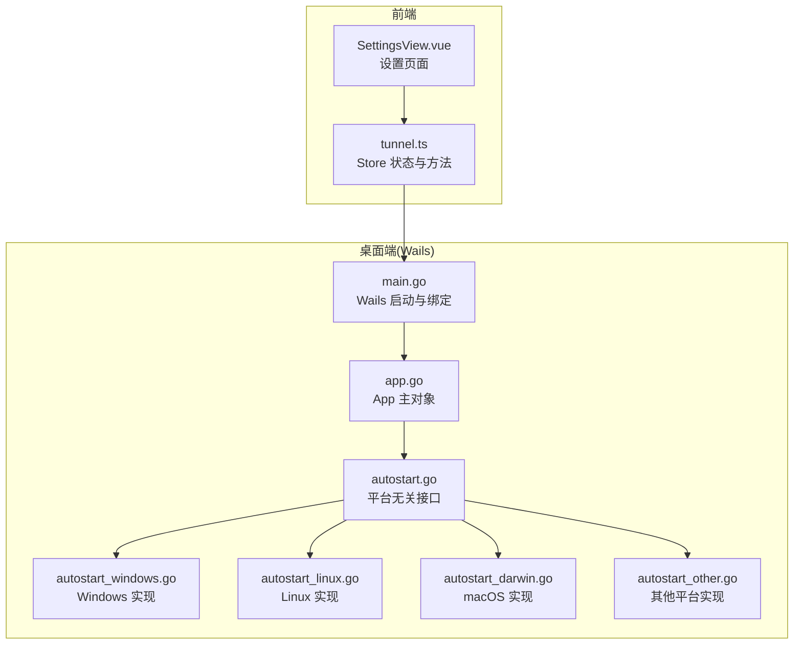
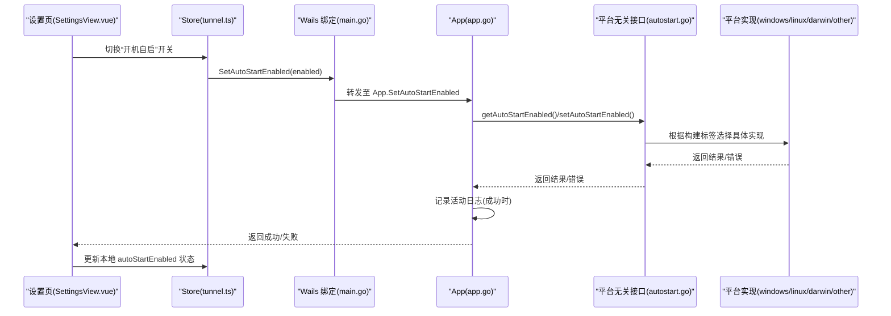
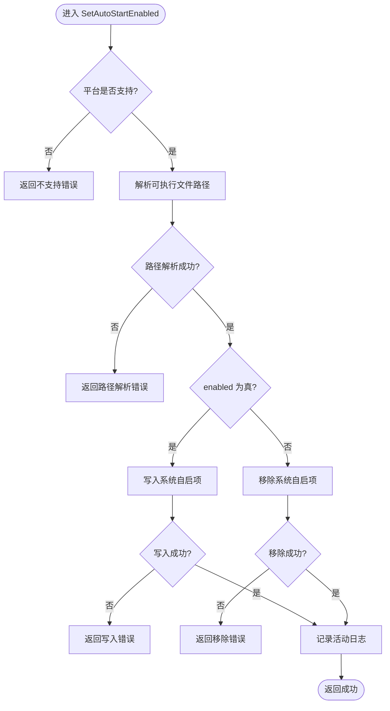
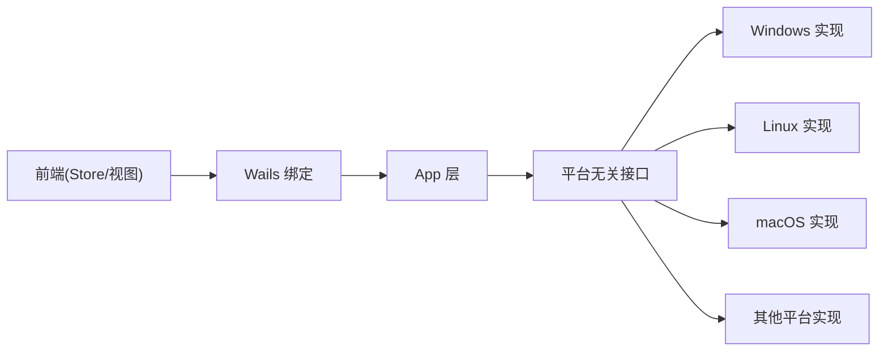

# 跨平台自动启动

<cite>
**本文引用的文件**
- [desktop/autostart.go](file://desktop/autostart.go)
- [desktop/autostart_windows.go](file://desktop/autostart_windows.go)
- [desktop/autostart_linux.go](file://desktop/autostart_linux.go)
- [desktop/autostart_darwin.go](file://desktop/autostart_darwin.go)
- [desktop/autostart_other.go](file://desktop/autostart_other.go)
- [desktop/app.go](file://desktop/app.go)
- [desktop/main.go](file://desktop/main.go)
- [desktop/frontend/src/stores/tunnel.ts](file://desktop/frontend/src/stores/tunnel.ts)
- [desktop/frontend/src/views/SettingsView.vue](file://desktop/frontend/src/views/SettingsView.vue)
</cite>

## 目录
1. [简介](#简介)
2. [项目结构](#项目结构)
3. [核心组件](#核心组件)
4. [架构总览](#架构总览)
5. [详细组件分析](#详细组件分析)
6. [依赖关系分析](#依赖关系分析)
7. [性能与可靠性考虑](#性能与可靠性考虑)
8. [故障排查指南](#故障排查指南)
9. [结论](#结论)

## 简介
本文件聚焦于桌面端“跨平台自动启动”能力的设计与实现，覆盖 Windows、macOS、Linux 以及其它平台的差异化处理。该功能通过用户级机制（无需系统管理员权限）在操作系统中注册或移除开机自启项，并在前端设置页提供开关与状态展示。后端以平台无关的接口对外暴露，内部按平台选择具体实现；前端通过 Wails 绑定调用 Go 方法完成读写。

## 项目结构
围绕自动启动的相关代码主要位于 desktop 包内：
- 平台无关接口与日志记录：desktop/autostart.go
- 平台特定实现：
  - Windows: desktop/autostart_windows.go
  - Linux: desktop/autostart_linux.go
  - macOS: desktop/autostart_darwin.go
  - 其他平台：desktop/autostart_other.go
- 应用入口与 Wails 绑定：desktop/main.go、desktop/app.go
- 前端交互：
  - 状态与方法调用：desktop/frontend/src/stores/tunnel.ts
  - 设置界面：desktop/frontend/src/views/SettingsView.vue

图表来源
- [desktop/main.go:16-44](file://desktop/main.go#L16-L44)
- [desktop/app.go:99-119](file://desktop/app.go#L99-L119)
- [desktop/autostart.go:5-33](file://desktop/autostart.go#L5-L33)
- [desktop/autostart_windows.go:14-54](file://desktop/autostart_windows.go#L14-L54)
- [desktop/autostart_linux.go:12-60](file://desktop/autostart_linux.go#L12-L60)
- [desktop/autostart_darwin.go:12-68](file://desktop/autostart_darwin.go#L12-L68)
- [desktop/autostart_other.go:7-16](file://desktop/autostart_other.go#L7-L16)
- [desktop/frontend/src/stores/tunnel.ts:310-340](file://desktop/frontend/src/stores/tunnel.ts#L310-L340)
- [desktop/frontend/src/views/SettingsView.vue:511-520](file://desktop/frontend/src/views/SettingsView.vue#L511-L520)

章节来源
- [desktop/main.go:16-44](file://desktop/main.go#L16-L44)
- [desktop/app.go:99-119](file://desktop/app.go#L99-L119)
- [desktop/autostart.go:5-33](file://desktop/autostart.go#L5-L33)
- [desktop/autostart_windows.go:14-54](file://desktop/autostart_windows.go#L14-L54)
- [desktop/autostart_linux.go:12-60](file://desktop/autostart_linux.go#L12-L60)
- [desktop/autostart_darwin.go:12-68](file://desktop/autostart_darwin.go#L12-L68)
- [desktop/autostart_other.go:7-16](file://desktop/autostart_other.go#L7-L16)
- [desktop/frontend/src/stores/tunnel.ts:310-340](file://desktop/frontend/src/stores/tunnel.ts#L310-L340)
- [desktop/frontend/src/views/SettingsView.vue:511-520](file://desktop/frontend/src/views/SettingsView.vue#L511-L520)

## 核心组件
- 平台无关接口
  - GetAutoStartEnabled(): 返回当前用户级开机自启是否启用；读取失败时记录错误并返回 false。
  - SetAutoStartEnabled(enabled bool): 设置当前用户级开机自启；成功则写入活动日志。
- 平台特定实现
  - Windows: 通过当前用户注册表 Run 键管理自启项。
  - Linux: 在当前用户配置目录 autostart 下创建/删除 .desktop 文件。
  - macOS: 在当前用户 LaunchAgents 目录下创建/删除 plist 文件。
  - 其他平台: 不支持开启；关闭操作视为成功。
- 前端集成
  - Store 提供 loadGeneralSettings() 与 setAutoStartEnabled() 等方法，负责加载状态与更新本地模型。
  - 设置页提供“开机自启”开关，绑定到 store 的方法进行读写。

章节来源
- [desktop/autostart.go:5-33](file://desktop/autostart.go#L5-L33)
- [desktop/autostart_windows.go:14-54](file://desktop/autostart_windows.go#L14-L54)
- [desktop/autostart_linux.go:12-60](file://desktop/autostart_linux.go#L12-L60)
- [desktop/autostart_darwin.go:12-68](file://desktop/autostart_darwin.go#L12-L68)
- [desktop/autostart_other.go:7-16](file://desktop/autostart_other.go#L7-L16)
- [desktop/frontend/src/stores/tunnel.ts:310-340](file://desktop/frontend/src/stores/tunnel.ts#L310-L340)
- [desktop/frontend/src/views/SettingsView.vue:511-520](file://desktop/frontend/src/views/SettingsView.vue#L511-L520)

## 架构总览
整体流程为：前端设置页触发开关 → Store 调用 Wails 绑定的 Go 方法 → App 层调用平台无关接口 → 平台特定实现读写系统位置 → 成功后写活动日志 → 前端刷新状态。

图表来源
- [desktop/main.go:16-44](file://desktop/main.go#L16-L44)
- [desktop/app.go:99-119](file://desktop/app.go#L99-L119)
- [desktop/autostart.go:5-33](file://desktop/autostart.go#L5-L33)
- [desktop/autostart_windows.go:14-54](file://desktop/autostart_windows.go#L14-L54)
- [desktop/autostart_linux.go:12-60](file://desktop/autostart_linux.go#L12-L60)
- [desktop/autostart_darwin.go:12-68](file://desktop/autostart_darwin.go#L12-L68)
- [desktop/autostart_other.go:7-16](file://desktop/autostart_other.go#L7-L16)
- [desktop/frontend/src/stores/tunnel.ts:310-340](file://desktop/frontend/src/stores/tunnel.ts#L310-L340)
- [desktop/frontend/src/views/SettingsView.vue:511-520](file://desktop/frontend/src/views/SettingsView.vue#L511-L520)

## 详细组件分析

### 平台无关接口 (autostart.go)
- 职责
  - 封装对系统自启状态的查询与设置。
  - 统一错误上报与活动日志记录。
- 关键行为
  - GetAutoStartEnabled(): 调用底层 getAutoStartEnabled()，出错时记录错误并返回 false。
  - SetAutoStartEnabled(): 调用底层 setAutoStartEnabled()，成功时追加一条安全类活动日志，包含动作、目标类型、标题、消息与元数据。
- 复杂度
  - 时间复杂度 O(1)，空间复杂度 O(1)。
- 错误处理
  - 读取失败不抛异常，而是记录错误并返回默认值，保证前端体验稳定。
- 可优化点
  - 可将活动日志写入持久化存储，便于审计与排障。

章节来源
- [desktop/autostart.go:5-33](file://desktop/autostart.go#L5-L33)

### Windows 实现 (autostart_windows.go)
- 机制
  - 使用当前用户注册表路径 Software\Microsoft\Windows\CurrentVersion\Run。
  - 通过字符串值 NexTunnel 指向可执行文件路径（带引号）。
- 关键行为
  - getAutoStartEnabled(): 打开键、读取字符串值，不存在视为未启用。
  - setAutoStartEnabled(): 若禁用则删除值；若启用则写入带引号的完整路径。
- 边界情况
  - 路径解析失败、注册表访问失败均返回错误。
- 复杂度
  - 时间复杂度 O(1)，空间复杂度 O(1)。

章节来源
- [desktop/autostart_windows.go:14-54](file://desktop/autostart_windows.go#L14-L54)

### Linux 实现 (autostart_linux.go)
- 机制
  - 在当前用户配置目录 autostart 下创建 nextunnel.desktop。
  - 内容包含 Exec= 指向可执行文件路径。
- 关键行为
  - getAutoStartEnabled(): 读取 .desktop 文件，判断是否包含当前可执行路径。
  - setAutoStartEnabled(): 禁用则删除文件；启用则确保目录存在并写入文件。
- 边界情况
  - 目录创建失败、文件写入失败均返回错误。
- 复杂度
  - 时间复杂度 O(n)（n 为文件内容长度），空间复杂度 O(n)。

章节来源
- [desktop/autostart_linux.go:12-60](file://desktop/autostart_linux.go#L12-L60)

### macOS 实现 (autostart_darwin.go)
- 机制
  - 在当前用户 Library/LaunchAgents 下创建 com.nextunnel.desktop.plist。
  - 使用 ProgramArguments 指定可执行文件路径，RunAtLoad=true。
- 关键行为
  - getAutoStartEnabled(): 读取 plist 文本，判断是否包含当前可执行路径。
  - setAutoStartEnabled(): 禁用则删除文件；启用则确保目录存在并写入 plist。
- 边界情况
  - 目录创建失败、文件写入失败均返回错误。
- 复杂度
  - 时间复杂度 O(n)（n 为文件内容长度），空间复杂度 O(n)。

章节来源
- [desktop/autostart_darwin.go:12-68](file://desktop/autostart_darwin.go#L12-L68)

### 其他平台实现 (autostart_other.go)
- 行为
  - 获取状态始终返回 false。
  - 设置为 true 时返回“不支持”的错误；设置为 false 视为成功。
- 适用场景
  - 非主流或未适配平台，避免误改系统状态。

章节来源
- [desktop/autostart_other.go:7-16](file://desktop/autostart_other.go#L7-L16)

### 前端集成 (Store 与设置页)
- Store 方法
  - loadGeneralSettings(): 同时加载通用设置与自动启动状态。
  - setAutoStartEnabled(enabled): 调用后端设置并更新本地状态。
- 设置页
  - 提供“开机自启”开关，绑定到 store 的 setAutoStartEnabled 方法，并在保存过程中显示加载态。
- 交互时序
  - 用户切换开关 → Store 调用后端 → 成功后更新本地状态 → 界面反馈。

章节来源
- [desktop/frontend/src/stores/tunnel.ts:310-340](file://desktop/frontend/src/stores/tunnel.ts#L310-L340)
- [desktop/frontend/src/views/SettingsView.vue:511-520](file://desktop/frontend/src/views/SettingsView.vue#L511-L520)

### 算法流程图（设置自动启动）

图表来源
- [desktop/autostart.go:15-33](file://desktop/autostart.go#L15-L33)
- [desktop/autostart_windows.go:34-54](file://desktop/autostart_windows.go#L34-L54)
- [desktop/autostart_linux.go:31-60](file://desktop/autostart_linux.go#L31-L60)
- [desktop/autostart_darwin.go:31-68](file://desktop/autostart_darwin.go#L31-L68)
- [desktop/autostart_other.go:11-16](file://desktop/autostart_other.go#L11-L16)

## 依赖关系分析
- 模块耦合
  - 前端仅依赖 Wails 暴露的方法，不感知平台差异。
  - App 层通过平台无关接口解耦平台实现。
  - 平台实现之间无相互依赖，各自独立维护系统位置。
- 外部依赖
  - Windows: 注册表访问。
  - Linux: 文件系统读写（用户配置目录）。
  - macOS: 文件系统读写（LaunchAgents 目录）。
- 潜在循环依赖
  - 无直接循环依赖；各平台实现由构建标签选择。

图表来源
- [desktop/main.go:16-44](file://desktop/main.go#L16-L44)
- [desktop/app.go:99-119](file://desktop/app.go#L99-L119)
- [desktop/autostart.go:5-33](file://desktop/autostart.go#L5-L33)
- [desktop/autostart_windows.go:14-54](file://desktop/autostart_windows.go#L14-L54)
- [desktop/autostart_linux.go:12-60](file://desktop/autostart_linux.go#L12-L60)
- [desktop/autostart_darwin.go:12-68](file://desktop/autostart_darwin.go#L12-L68)
- [desktop/autostart_other.go:7-16](file://desktop/autostart_other.go#L7-L16)

## 性能与可靠性考虑
- 性能
  - 所有操作均为轻量 I/O 或注册表访问，耗时极低，适合频繁调用。
- 可靠性
  - 读取失败返回默认值，避免前端阻塞。
  - 写入失败返回明确错误，便于前端提示与重试。
- 安全性
  - 仅操作当前用户范围，无需管理员权限。
  - 活动日志记录变更事件，便于审计。

[本节为通用指导，不直接分析具体文件]

## 故障排查指南
- 常见问题
  - 无法写入自启项：检查目标目录/注册表键是否存在且可写。
  - 路径解析失败：确认可执行文件路径可用。
  - 其他平台开启失败：属于预期行为，需回退到手动方式。
- 定位步骤
  - 查看活动日志中的相关条目（如“开机自启设置已更新”）。
  - 核对平台特定位置：
    - Windows: 当前用户 Run 键。
    - Linux: ~/.config/autostart/nextunnel.desktop。
    - macOS: ~/Library/LaunchAgents/com.nextunnel.desktop.plist。
- 恢复建议
  - 先尝试关闭再重新开启。
  - 清理残留文件/键后重试。

章节来源
- [desktop/autostart.go:15-33](file://desktop/autostart.go#L15-L33)
- [desktop/autostart_windows.go:14-54](file://desktop/autostart_windows.go#L14-L54)
- [desktop/autostart_linux.go:12-60](file://desktop/autostart_linux.go#L12-L60)
- [desktop/autostart_darwin.go:12-68](file://desktop/autostart_darwin.go#L12-L68)
- [desktop/autostart_other.go:7-16](file://desktop/autostart_other.go#L7-L16)

## 结论
本项目通过平台无关接口与平台特定实现的组合，实现了跨平台用户级开机自启能力。前端以简洁的开关交互驱动后端逻辑，后端在成功时记录活动日志，便于追踪与审计。整体设计清晰、扩展性好，易于在未来新增更多平台支持。