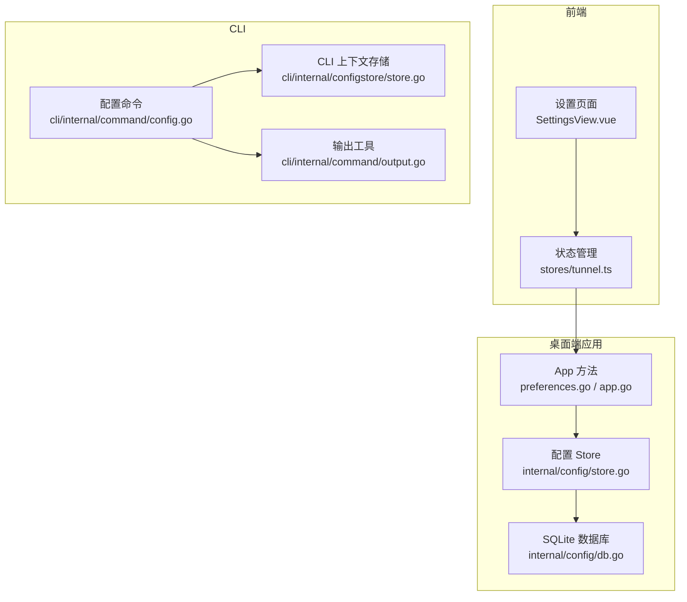
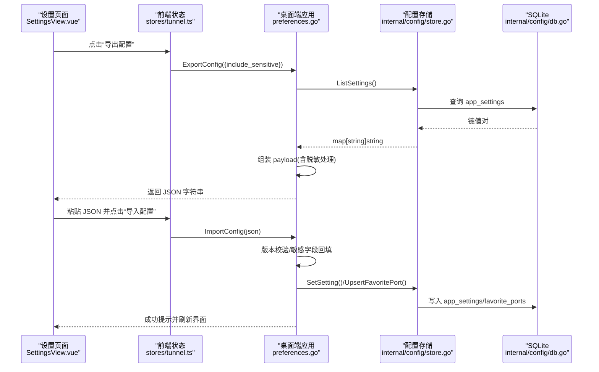
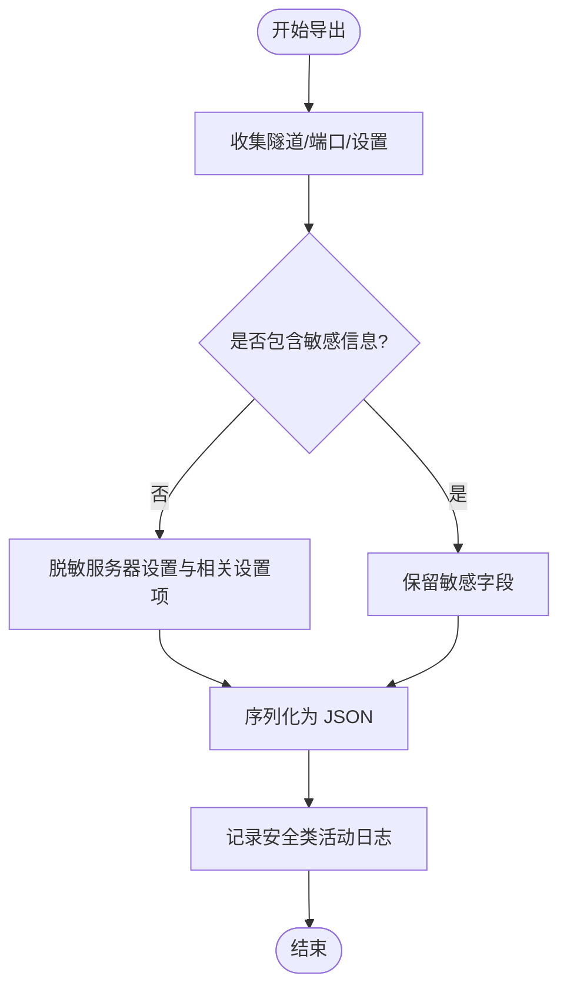
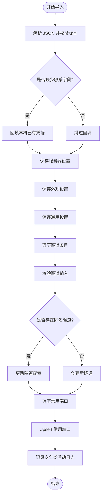
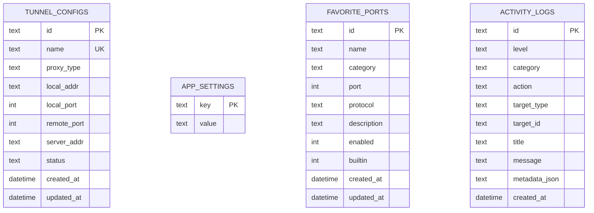
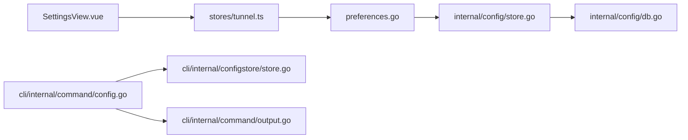

# 配置导入导出系统

<cite>
**本文引用的文件**   
- [preferences.go](file://desktop/preferences.go)
- [app.go](file://desktop/app.go)
- [store.go](file://desktop/internal/config/store.go)
- [db.go](file://desktop/internal/config/db.go)
- [SettingsView.vue](file://desktop/frontend/src/views/SettingsView.vue)
- [tunnel.ts](file://desktop/frontend/src/stores/tunnel.ts)
- [config.go](file://cli/internal/command/config.go)
- [output.go](file://cli/internal/command/output.go)
- [store.go](file://cli/internal/configstore/store.go)
</cite>

## 目录
1. [简介](#简介)
2. [项目结构](#项目结构)
3. [核心组件](#核心组件)
4. [架构总览](#架构总览)
5. [详细组件分析](#详细组件分析)
6. [依赖关系分析](#依赖关系分析)
7. [性能与一致性](#性能与一致性)
8. [故障排查指南](#故障排查指南)
9. [结论](#结论)
10. [附录：数据模型与字段说明](#附录数据模型与字段说明)

## 简介
本章节面向“桌面端配置导入导出”能力，覆盖以下目标：
- 将桌面端的连接、外观、通用设置、隧道、常用端口与应用设置序列化为 JSON 并支持回导。
- 默认对敏感字段进行脱敏处理，提供可选的包含敏感信息导出模式。
- 在导入时复用现有校验逻辑，确保数据稳健与向后兼容。
- 记录操作审计日志，便于追踪配置变更来源与影响范围。

## 项目结构
配置导入导出涉及前端交互、Go 应用层、SQLite 持久化以及 CLI 上下文管理四个层次：
- 前端界面：设置页提供导出/导入按钮与开关，调用 Wails 暴露的方法。
- 应用层：负责读取当前状态、序列化/反序列化、敏感字段处理、写入持久化。
- 持久化层：基于 SQLite 存储隧道、设置、常用端口与活动日志。
- CLI 上下文：独立于桌面端配置的远端上下文管理（用于 CLI 命令）。

图表来源
- [SettingsView.vue:504-540](file://desktop/frontend/src/views/SettingsView.vue#L504-L540)
- [tunnel.ts:342-365](file://desktop/frontend/src/stores/tunnel.ts#L342-L365)
- [preferences.go:141-288](file://desktop/preferences.go#L141-L288)
- [store.go:236-254](file://desktop/internal/config/store.go#L236-L254)
- [db.go:74-118](file://desktop/internal/config/db.go#L74-L118)
- [config.go:10-23](file://cli/internal/command/config.go#L10-L23)
- [output.go:16-27](file://cli/internal/command/output.go#L16-L27)
- [store.go:28-86](file://cli/internal/configstore/store.go#L28-L86)

章节来源
- [SettingsView.vue:504-540](file://desktop/frontend/src/views/SettingsView.vue#L504-L540)
- [tunnel.ts:342-365](file://desktop/frontend/src/stores/tunnel.ts#L342-L365)
- [preferences.go:141-288](file://desktop/preferences.go#L141-L288)
- [store.go:236-254](file://desktop/internal/config/store.go#L236-L254)
- [db.go:74-118](file://desktop/internal/config/db.go#L74-L118)
- [config.go:10-23](file://cli/internal/command/config.go#L10-L23)
- [output.go:16-27](file://cli/internal/command/output.go#L16-L27)
- [store.go:28-86](file://cli/internal/configstore/store.go#L28-L86)

## 核心组件
- 导出入口与选项
  - 导出选项：是否包含敏感字段。
  - 导出内容：服务器连接设置、外观设置、通用设置、隧道列表、常用端口、应用设置。
- 导入流程
  - 版本校验、敏感字段回填、设置与隧道/端口落库、活动日志记录。
- 持久化
  - SQLite 表：隧道配置、应用设置、常用端口、活动日志。
- CLI 上下文
  - 独立的 JSON 配置文件，管理远端控制面与 Dashboard 上下文。

章节来源
- [preferences.go:51-64](file://desktop/preferences.go#L51-L64)
- [preferences.go:141-194](file://desktop/preferences.go#L141-L194)
- [preferences.go:196-288](file://desktop/preferences.go#L196-L288)
- [store.go:236-254](file://desktop/internal/config/store.go#L236-L254)
- [db.go:13-66](file://desktop/internal/config/db.go#L13-L66)
- [config.go:10-23](file://cli/internal/command/config.go#L10-L23)
- [store.go:22-26](file://cli/internal/configstore/store.go#L22-L26)

## 架构总览
下图展示了从前端到后端再到持久化的完整导入导出链路，以及 CLI 上下文管理的独立路径。

图表来源
- [SettingsView.vue:1297-1323](file://desktop/frontend/src/views/SettingsView.vue#L1297-L1323)
- [tunnel.ts:342-365](file://desktop/frontend/src/stores/tunnel.ts#L342-L365)
- [preferences.go:141-288](file://desktop/preferences.go#L141-L288)
- [store.go:236-254](file://desktop/internal/config/store.go#L236-L254)
- [db.go:74-118](file://desktop/internal/config/db.go#L74-L118)

## 详细组件分析

### 导出流程
- 触发点
  - 前端设置页提供“导出配置”按钮与“包含敏感信息”开关。
- 关键步骤
  - 收集隧道、常用端口、应用设置。
  - 根据选项决定是否对服务器连接设置中的敏感字段进行脱敏。
  - 生成带缩进的 JSON 文本并记录安全类活动日志。
- 敏感字段处理
  - 默认不导出 Relay Token、Control Plane Token 及节点列表中的敏感字段。
  - 若选择包含敏感信息，则原样导出。

图表来源
- [preferences.go:141-194](file://desktop/preferences.go#L141-L194)
- [preferences.go:365-373](file://desktop/preferences.go#L365-L373)

章节来源
- [SettingsView.vue:504-540](file://desktop/frontend/src/views/SettingsView.vue#L504-L540)
- [tunnel.ts:342-350](file://desktop/frontend/src/stores/tunnel.ts#L342-L350)
- [preferences.go:141-194](file://desktop/preferences.go#L141-L194)
- [preferences.go:365-373](file://desktop/preferences.go#L365-L373)

### 导入流程
- 触发点
  - 前端设置页提供文本框粘贴 JSON 并点击“导入配置”。
- 关键步骤
  - 解析 JSON 并校验版本。
  - 若缺失敏感字段，则回填本机已有凭据，避免误清空。
  - 依次保存服务器设置、外观设置、通用设置。
  - 按名称匹配或新建隧道；保存常用端口。
  - 记录安全类活动日志。
- 健壮性保障
  - 复用隧道创建输入校验逻辑。
  - 使用 Upsert 策略更新常用端口，避免重复。

图表来源
- [preferences.go:196-288](file://desktop/preferences.go#L196-L288)
- [app.go:421-450](file://desktop/app.go#L421-L450)
- [store.go:256-275](file://desktop/internal/config/store.go#L256-L275)

章节来源
- [SettingsView.vue:1309-1323](file://desktop/frontend/src/views/SettingsView.vue#L1309-L1323)
- [tunnel.ts:352-365](file://desktop/frontend/src/stores/tunnel.ts#L352-L365)
- [preferences.go:196-288](file://desktop/preferences.go#L196-L288)
- [app.go:421-450](file://desktop/app.go#L421-L450)
- [store.go:256-275](file://desktop/internal/config/store.go#L256-L275)

### 持久化与数据模型
- 表结构
  - tunnel_configs：隧道配置（唯一名称、协议、本地/远端端口等）。
  - app_settings：键值型应用设置（包括语言、自动连接、托盘行为、导出偏好等）。
  - favorite_ports：常用端口（去重键为协议+端口，支持内置标记）。
  - activity_logs：活动日志（级别、分类、动作、标题、消息、元数据 JSON）。
- 访问优化
  - 单连接、WAL 模式、同步策略调优。
  - 批量设置写入采用事务减少写锁竞争。
  - 活动日志查询限制上限，防止一次性加载过多记录。

图表来源
- [db.go:13-66](file://desktop/internal/config/db.go#L13-L66)

章节来源
- [db.go:13-66](file://desktop/internal/config/db.go#L13-L66)
- [store.go:209-234](file://desktop/internal/config/store.go#L209-L234)
- [store.go:312-358](file://desktop/internal/config/store.go#L312-L358)

### CLI 上下文配置（独立）
- 作用
  - 管理 CLI 的远端上下文（Control Plane/Dashboard 地址与令牌），与桌面端配置相互独立。
- 特性
  - 支持设置、切换、列出上下文。
  - 配置文件权限设置为仅所有者可读写，保护敏感信息。
  - 输出支持 JSON 与表格两种格式。

章节来源
- [config.go:10-23](file://cli/internal/command/config.go#L10-L23)
- [config.go:39-74](file://cli/internal/command/config.go#L39-L74)
- [config.go:76-121](file://cli/internal/command/config.go#L76-L121)
- [output.go:16-27](file://cli/internal/command/output.go#L16-L27)
- [store.go:28-86](file://cli/internal/configstore/store.go#L28-L86)

## 依赖关系分析
- 前端依赖
  - SettingsView.vue 通过 stores/tunnel.ts 调用 Wails 暴露的导出/导入方法。
- 应用层依赖
  - preferences.go 聚合各模块数据，执行脱敏/回填与持久化。
  - app.go 提供 ServerSettings 定义与隧道 CRUD 辅助。
- 持久化依赖
  - internal/config/store.go 封装 SQLite 操作，提供设置、隧道、端口与日志接口。
  - internal/config/db.go 负责数据库初始化、迁移与连接参数。
- CLI 依赖
  - cli/internal/command/config.go 组合 cobra 子命令，调用 cli/internal/configstore/store.go 读写 JSON 上下文。

图表来源
- [SettingsView.vue:1297-1323](file://desktop/frontend/src/views/SettingsView.vue#L1297-L1323)
- [tunnel.ts:342-365](file://desktop/frontend/src/stores/tunnel.ts#L342-L365)
- [preferences.go:141-288](file://desktop/preferences.go#L141-L288)
- [store.go:236-254](file://desktop/internal/config/store.go#L236-L254)
- [db.go:74-118](file://desktop/internal/config/db.go#L74-L118)
- [config.go:10-23](file://cli/internal/command/config.go#L10-L23)
- [output.go:16-27](file://cli/internal/command/output.go#L16-L27)
- [store.go:28-86](file://cli/internal/configstore/store.go#L28-L86)

章节来源
- [app.go:176-198](file://desktop/app.go#L176-L198)
- [store.go:236-254](file://desktop/internal/config/store.go#L236-L254)
- [db.go:74-118](file://desktop/internal/config/db.go#L74-L118)
- [config.go:10-23](file://cli/internal/command/config.go#L10-L23)
- [output.go:16-27](file://cli/internal/command/output.go#L16-L27)
- [store.go:28-86](file://cli/internal/configstore/store.go#L28-L86)

## 性能与一致性
- 并发与锁
  - SQLite 单连接 + WAL 模式，降低读阻塞；批量设置写入使用事务减少写锁竞争。
- 查询限制
  - 活动日志查询限制最大条数，避免 UI 卡顿。
- 导入幂等
  - 常用端口以协议+端口为去重键，避免重复插入；隧道按名称匹配更新或新增。
- 兼容性
  - 导出版本校验，拒绝不支持的版本；导入时对缺失字段进行回填，保证最小可用配置。

章节来源
- [db.go:89-118](file://desktop/internal/config/db.go#L89-L118)
- [store.go:209-234](file://desktop/internal/config/store.go#L209-L234)
- [store.go:360-396](file://desktop/internal/config/store.go#L360-L396)
- [store.go:256-275](file://desktop/internal/config/store.go#L256-L275)
- [preferences.go:196-207](file://desktop/preferences.go#L196-L207)

## 故障排查指南
- 导入失败：JSON 解析错误
  - 检查粘贴的 JSON 是否符合导出格式，确认版本字段有效。
- 导入失败：版本不受支持
  - 确认导出来源与当前桌面端版本兼容。
- 导入后连接失效
  - 默认导出会脱敏 token；请勾选“包含敏感信息”重新导出，或在导入前手动补充凭据。
- 导入后隧道未生效
  - 检查隧道名称是否与现有冲突；导入逻辑会更新同名隧道或创建新隧道。
- 活动日志为空
  - 检查活动日志查询条件与限制；必要时扩大 Limit 或清除过滤条件。

章节来源
- [preferences.go:196-207](file://desktop/preferences.go#L196-L207)
- [preferences.go:228-261](file://desktop/preferences.go#L228-L261)
- [store.go:360-396](file://desktop/internal/config/store.go#L360-L396)

## 结论
该配置导入导出系统在前端、应用层与持久化层之间形成清晰的数据流，具备以下特点：
- 安全性：默认脱敏敏感字段，支持可选包含敏感信息的导出模式。
- 健壮性：导入时进行版本校验与输入验证，并对缺失凭据进行回填。
- 可观测性：所有关键操作均记录活动日志，便于审计与排障。
- 可扩展性：应用设置采用键值存储，便于未来扩展更多配置项。

## 附录：数据模型与字段说明
- 导出对象字段
  - version：导出格式版本号。
  - server：服务器连接设置（默认脱敏）。
  - appearance：外观设置（主题、动效、语言、强调色）。
  - general：通用设置（自动连接、托盘、启动最小化、导出偏好、语言）。
  - tunnels：隧道列表（名称、协议、本地/远端端口等）。
  - favorite_ports：常用端口（名称、分类、端口、协议、描述、启用状态、是否内置）。
  - settings：应用设置键值对（如语言、自动连接、托盘、导出偏好等）。
- CLI 上下文字段
  - current_context：当前上下文名称。
  - contexts：上下文映射（名称、Control Plane/Dashboard 地址与令牌）。

章节来源
- [preferences.go:56-64](file://desktop/preferences.go#L56-L64)
- [app.go:176-198](file://desktop/app.go#L176-L198)
- [store.go:22-26](file://cli/internal/configstore/store.go#L22-L26)