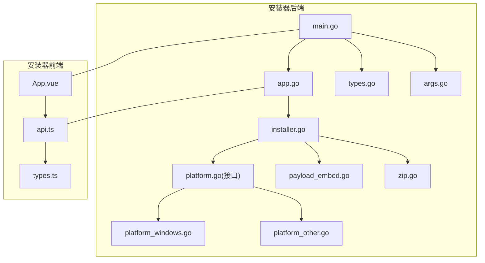
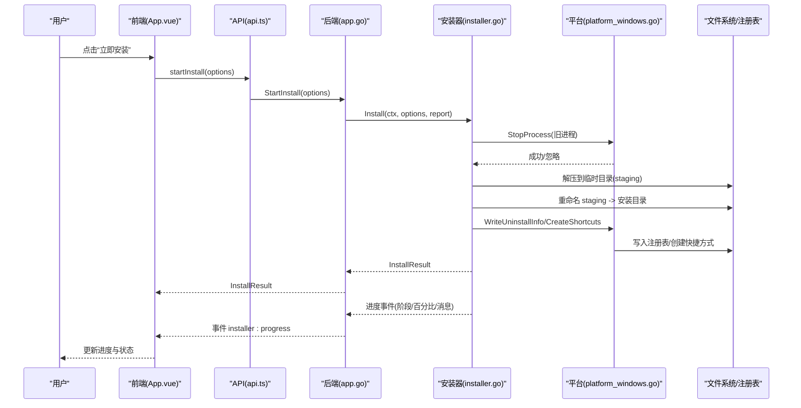
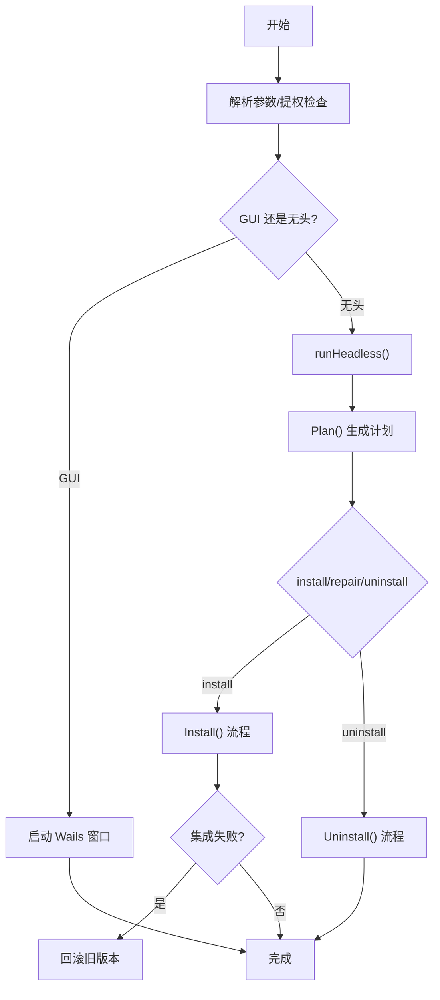
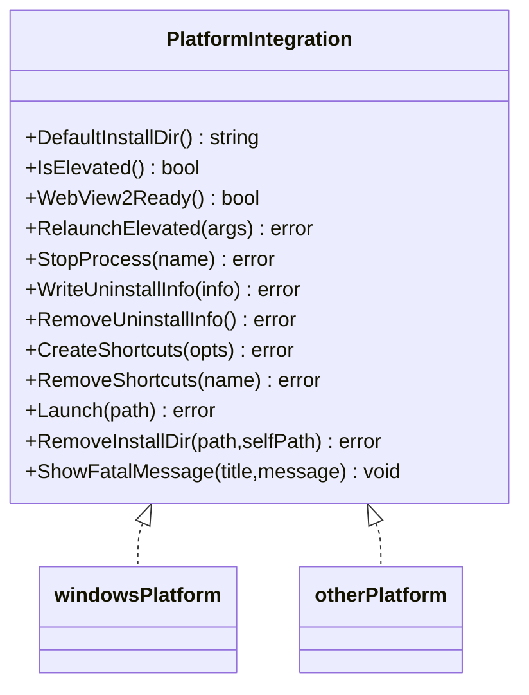
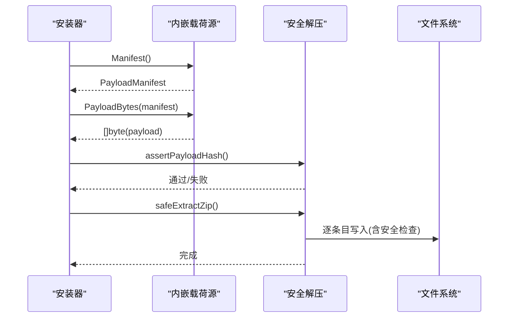
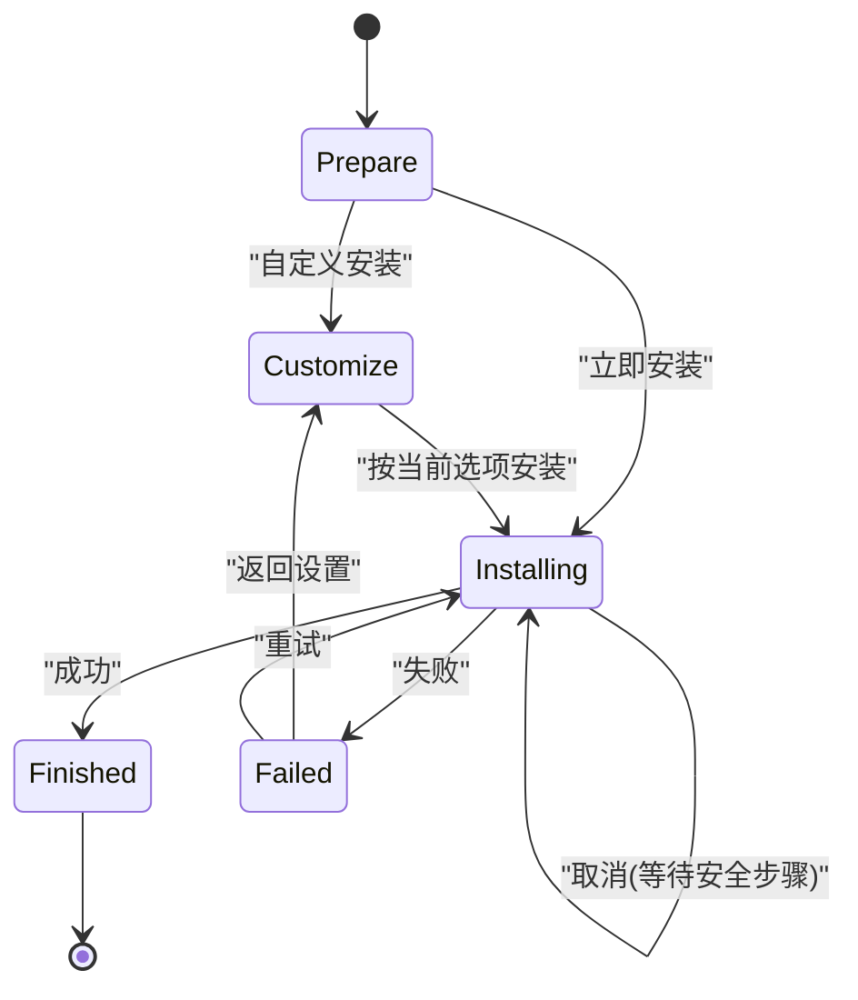
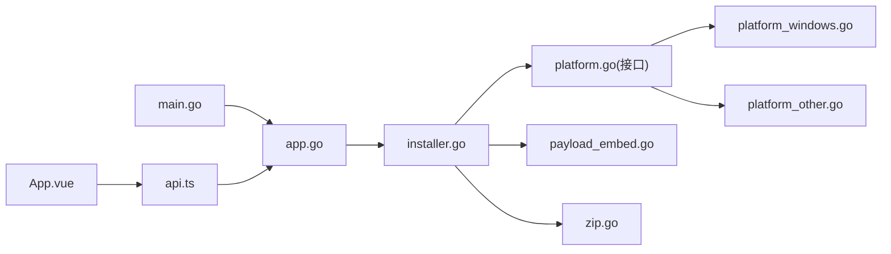

# Windows安装器框架

<cite>
**本文引用的文件**   
- [main.go](file://installer/main.go)
- [installer.go](file://installer/installer.go)
- [app.go](file://installer/app.go)
- [platform_windows.go](file://installer/platform_windows.go)
- [platform_other.go](file://installer/platform_other.go)
- [platform.go](file://installer/platform.go)
- [types.go](file://installer/types.go)
- [args.go](file://installer/args.go)
- [payload_embed.go](file://installer/payload_embed.go)
- [zip.go](file://installer/zip.go)
- [App.vue](file://installer/frontend/src/App.vue)
- [api.ts](file://installer/frontend/src/api.ts)
- [types.ts](file://installer/frontend/src/types.ts)
- [placeholder.txt](file://installer/payload/placeholder.txt)
</cite>

## 目录
1. [简介](#简介)
2. [项目结构](#项目结构)
3. [核心组件](#核心组件)
4. [架构总览](#架构总览)
5. [详细组件分析](#详细组件分析)
6. [依赖关系分析](#依赖关系分析)
7. [性能与可靠性考虑](#性能与可靠性考虑)
8. [故障排查指南](#故障排查指南)
9. [结论](#结论)
10. [附录](#附录)

## 简介
本文件系统化梳理 NexTunnel 的 Windows 安装器框架，涵盖整体架构、关键模块职责、数据流与控制流、平台集成点、错误处理与回滚策略、以及前端交互流程。该安装器基于 Wails 构建桌面 UI，支持 GUI 与无头（命令行）两种模式，提供安装、修复、卸载能力，并通过内嵌 payload 与 SHA256 校验保障完整性，结合 staging + rename 原子替换与回滚机制提升升级安全性。

## 项目结构
安装器位于 installer 子模块，采用“后端 Go + 前端 Vue”的双端结构：
- 后端（Go）
  - main.go：程序入口、参数解析、GUI/无头分支、Wails 启动
  - app.go：Wails 绑定对象，暴露 GetInstallPlan/StartInstall/CancelInstall/SelectInstallDir/StartUninstall 等 API
  - installer.go：安装/卸载主流程、计划生成、进度上报、回滚逻辑
  - platform_*.go：平台抽象接口与 Windows/非 Windows 实现
  - types.go/args.go：类型定义与命令行参数解析
  - payload_embed.go：从内嵌资源读取 manifest 与 payload
  - zip.go：安全解压、路径越界防护、大小限制
- 前端（Vue）
  - App.vue：安装向导界面、状态机、步骤展示、错误提示
  - api.ts：通过 window.go.main.App 调用后端方法，订阅事件
  - types.ts：前后端共享的数据结构类型

图表来源
- [main.go:19-75](file://installer/main.go#L19-L75)
- [app.go:24-99](file://installer/app.go#L24-L99)
- [installer.go:30-158](file://installer/installer.go#L30-L158)
- [platform.go:22-35](file://installer/platform.go#L22-L35)
- [platform_windows.go:24-178](file://installer/platform_windows.go#L24-L178)
- [platform_other.go:13-47](file://installer/platform_other.go#L13-L47)
- [payload_embed.go:27-50](file://installer/payload_embed.go#L27-L50)
- [zip.go:30-107](file://installer/zip.go#L30-L107)
- [App.vue:295-340](file://installer/frontend/src/App.vue#L295-L340)
- [api.ts:3-33](file://installer/frontend/src/api.ts#L3-L33)
- [types.ts:1-38](file://installer/frontend/src/types.ts#L1-L38)

章节来源
- [main.go:19-75](file://installer/main.go#L19-L75)
- [app.go:24-99](file://installer/app.go#L24-L99)
- [installer.go:30-158](file://installer/installer.go#L30-L158)
- [platform.go:22-35](file://installer/platform.go#L22-L35)
- [platform_windows.go:24-178](file://installer/platform_windows.go#L24-L178)
- [platform_other.go:13-47](file://installer/platform_other.go#L13-L47)
- [payload_embed.go:27-50](file://installer/payload_embed.go#L27-L50)
- [zip.go:30-107](file://installer/zip.go#L30-L107)
- [App.vue:295-340](file://installer/frontend/src/App.vue#L295-L340)
- [api.ts:3-33](file://installer/frontend/src/api.ts#L3-L33)
- [types.ts:1-38](file://installer/frontend/src/types.ts#L1-L38)

## 核心组件
- 命令与模式
  - 支持 gui、install、repair、uninstall 四种模式；默认 gui；--silent 等价 install；--no-launch/--no-desktop-shortcut/--no-start-menu-shortcut 控制行为；--log 输出到文件；--version 打印版本。
- 安装器核心（Installer）
  - Plan：读取内嵌 manifest，填充目标平台、默认目录、管理员权限、WebView2 就绪状态、所需空间、签名信息、payload 是否就绪等。
  - Install：准备→校验→解压→替换→系统集成→完成；失败时回滚；可选完成后启动应用。
  - Uninstall：停止进程→移除快捷方式与卸载项→删除安装目录。
- 平台抽象（PlatformIntegration）
  - Windows 实现：提权检测与重启、任务管理器杀进程、注册表写入卸载信息、PowerShell 创建快捷方式、延迟删除目录等。
  - 非 Windows 实现：最小可用能力，便于跨平台测试。
- 载荷源（PayloadSource）
  - 从内嵌文件系统读取 manifest.json 与 payload.zip，并做默认值补齐。
- 安全解压（zip）
  - 拒绝符号链接、路径穿越、绝对路径、Windows 备用数据流、超大条目；严格限制解压目标在指定目录内。
- 前端（Vue）
  - 安装前检查、自定义选项、进度条、取消操作、结果页；通过事件通道接收后端进度。

章节来源
- [args.go:25-73](file://installer/args.go#L25-L73)
- [installer.go:30-158](file://installer/installer.go#L30-L158)
- [installer.go:160-191](file://installer/installer.go#L160-L191)
- [platform.go:22-35](file://installer/platform.go#L22-L35)
- [platform_windows.go:24-178](file://installer/platform_windows.go#L24-L178)
- [platform_other.go:13-47](file://installer/platform_other.go#L13-L47)
- [payload_embed.go:27-50](file://installer/payload_embed.go#L27-L50)
- [zip.go:30-107](file://installer/zip.go#L30-L107)
- [App.vue:295-340](file://installer/frontend/src/App.vue#L295-L340)

## 架构总览
安装器以 Wails 为桥接层，将 Go 后端方法绑定到前端 JavaScript 环境。前端通过 window.go.main.App 调用后端，同时监听 installer:progress 事件获取实时进度。

图表来源
- [App.vue:618-639](file://installer/frontend/src/App.vue#L618-L639)
- [api.ts:15-21](file://installer/frontend/src/api.ts#L15-L21)
- [app.go:43-48](file://installer/app.go#L43-L48)
- [installer.go:62-158](file://installer/installer.go#L62-L158)
- [platform_windows.go:81-95](file://installer/platform_windows.go#L81-L95)
- [platform_windows.go:97-146](file://installer/platform_windows.go#L97-L146)

## 详细组件分析

### 安装流程（GUI/无头通用）
- 入口与模式选择
  - main.go 解析命令行参数，若未提权则尝试以管理员身份重启自身；非 GUI 模式进入无头执行。
- 计划生成
  - installer.go 的 Plan 读取内嵌 manifest，填充系统能力与约束，供前端展示与决策。
- 安装执行
  - 校验 payload SHA256 → 解压到同卷 staging → 备份旧目录 → 原子替换 → 写入系统集成信息（注册表、快捷方式）→ 可选启动应用。
- 卸载执行
  - 停止进程 → 移除快捷方式与卸载项 → 删除安装目录（必要时延迟删除）。

图表来源
- [main.go:19-40](file://installer/main.go#L19-L40)
- [main.go:77-100](file://installer/main.go#L77-L100)
- [installer.go:30-60](file://installer/installer.go#L30-L60)
- [installer.go:62-158](file://installer/installer.go#L62-L158)
- [installer.go:160-191](file://installer/installer.go#L160-L191)
- [installer.go:245-251](file://installer/installer.go#L245-L251)

章节来源
- [main.go:19-40](file://installer/main.go#L19-L40)
- [main.go:77-100](file://installer/main.go#L77-L100)
- [installer.go:30-60](file://installer/installer.go#L30-L60)
- [installer.go:62-158](file://installer/installer.go#L62-L158)
- [installer.go:160-191](file://installer/installer.go#L160-L191)
- [installer.go:245-251](file://installer/installer.go#L245-L251)

### 平台集成（Windows）
- 提权与重启
  - 使用 ShellExecute runas 以管理员权限重启自身，保留原始参数。
- 进程管理
  - 使用 taskkill 终止旧版进程；不存在视为可继续。
- 系统集成
  - 写入 HKLM 卸载信息（显示名、版本、发布者、安装位置、图标、卸载字符串、估计大小）。
  - 通过 PowerShell 创建桌面与开始菜单快捷方式。
- 目录清理
  - 当安装目录位于安装器自身目录下时，使用后台脚本延迟删除以避免占用。

图表来源
- [platform.go:22-35](file://installer/platform.go#L22-L35)
- [platform_windows.go:24-178](file://installer/platform_windows.go#L24-L178)
- [platform_other.go:13-47](file://installer/platform_other.go#L13-L47)

章节来源
- [platform_windows.go:24-178](file://installer/platform_windows.go#L24-L178)
- [platform_other.go:13-47](file://installer/platform_other.go#L13-L47)
- [platform.go:22-35](file://installer/platform.go#L22-L35)

### 载荷与完整性校验
- 内嵌资源
  - 通过 go:embed 将 payload/* 打包进二进制；manifest.json 描述版本、目标、包文件名、SHA256、应用可执行名、所需空间、是否包含 wintun、签名信息等。
- 校验与解压
  - 计算 payload 的 SHA256 并与 manifest 对比；解压时进行路径安全检查与单文件大小限制；按条目数量推进解压进度。

图表来源
- [payload_embed.go:27-50](file://installer/payload_embed.go#L27-L50)
- [zip.go:17-28](file://installer/zip.go#L17-L28)
- [zip.go:30-52](file://installer/zip.go#L30-L52)

章节来源
- [payload_embed.go:27-50](file://installer/payload_embed.go#L27-L50)
- [zip.go:17-28](file://installer/zip.go#L17-L28)
- [zip.go:30-52](file://installer/zip.go#L30-L52)

### 前端交互与状态机
- 页面视图
  - prepare：展示安装前检查与概览卡片，引导快速安装或自定义选项。
  - customize：设置安装目录、快捷方式、完成后启动等。
  - installing/uninstalling：实时进度条、阶段列表、取消按钮。
  - finished/failed：结果摘要与重试/返回选项。
- 事件通信
  - 通过 onInstallProgress 订阅 installer:progress 事件，驱动 UI 更新。
  - 关闭窗口时若处于忙碌状态，先请求取消再退出。

图表来源
- [App.vue:295-340](file://installer/frontend/src/App.vue#L295-L340)
- [App.vue:570-578](file://installer/frontend/src/App.vue#L570-L578)
- [App.vue:618-639](file://installer/frontend/src/App.vue#L618-L639)
- [App.vue:641-662](file://installer/frontend/src/App.vue#L641-L662)
- [App.vue:697-704](file://installer/frontend/src/App.vue#L697-L704)
- [api.ts:31-33](file://installer/frontend/src/api.ts#L31-L33)

章节来源
- [App.vue:295-340](file://installer/frontend/src/App.vue#L295-L340)
- [App.vue:570-578](file://installer/frontend/src/App.vue#L570-L578)
- [App.vue:618-639](file://installer/frontend/src/App.vue#L618-L639)
- [App.vue:641-662](file://installer/frontend/src/App.vue#L641-L662)
- [App.vue:697-704](file://installer/frontend/src/App.vue#L697-L704)
- [api.ts:31-33](file://installer/frontend/src/api.ts#L31-L33)

## 依赖关系分析
- 模块耦合
  - main.go 仅负责启动与模式分发，业务集中在 app.go 与 installer.go。
  - installer.go 通过 PlatformIntegration 解耦平台差异，便于测试与扩展。
  - payload_embed.go 与 zip.go 专注载荷加载与安全解压，被 installer.go 组合使用。
- 外部依赖
  - Wails：提供 GUI 运行时、事件总线、原生对话框。
  - Windows 系统 API：提权、注册表、taskkill、PowerShell。
- 潜在循环依赖
  - 当前结构清晰，未见循环导入；前端通过 window.go.main.App 间接调用后端，不直接依赖 Go 包。

图表来源
- [main.go:19-75](file://installer/main.go#L19-L75)
- [app.go:24-99](file://installer/app.go#L24-L99)
- [installer.go:30-158](file://installer/installer.go#L30-L158)
- [platform.go:22-35](file://installer/platform.go#L22-L35)
- [platform_windows.go:24-178](file://installer/platform_windows.go#L24-L178)
- [platform_other.go:13-47](file://installer/platform_other.go#L13-L47)
- [payload_embed.go:27-50](file://installer/payload_embed.go#L27-L50)
- [zip.go:30-107](file://installer/zip.go#L30-L107)
- [App.vue:295-340](file://installer/frontend/src/App.vue#L295-L340)
- [api.ts:3-33](file://installer/frontend/src/api.ts#L3-L33)

章节来源
- [main.go:19-75](file://installer/main.go#L19-L75)
- [app.go:24-99](file://installer/app.go#L24-L99)
- [installer.go:30-158](file://installer/installer.go#L30-L158)
- [platform.go:22-35](file://installer/platform.go#L22-L35)
- [platform_windows.go:24-178](file://installer/platform_windows.go#L24-L178)
- [platform_other.go:13-47](file://installer/platform_other.go#L13-L47)
- [payload_embed.go:27-50](file://installer/payload_embed.go#L27-L50)
- [zip.go:30-107](file://installer/zip.go#L30-L107)
- [App.vue:295-340](file://installer/frontend/src/App.vue#L295-L340)
- [api.ts:3-33](file://installer/frontend/src/api.ts#L3-L33)

## 性能与可靠性考虑
- 原子替换与回滚
  - 使用同卷 staging 目录 + os.Rename 实现原子替换；集成失败自动回滚至旧版本，降低升级中断风险。
- 完整性校验
  - 强制 SHA256 校验，避免损坏或篡改的 payload 被部署。
- 安全解压
  - 禁止符号链接、路径穿越、绝对路径、Windows 备用数据流；限制单文件大小，防止资源耗尽。
- 进程管理
  - 安装前先停止旧进程，减少文件占用导致的替换失败。
- 资源估算
  - 根据 manifest 的 required_space_mb 提示磁盘需求，避免空间不足导致中途失败。

[本节为通用指导，无需列出具体文件来源]

## 故障排查指南
- 常见错误与定位
  - 缺少管理员权限：启动时自动尝试提权；若失败会弹出致命错误提示。
  - WebView2 未就绪：Plan 中 webview2_ready=false，前端会提示待引导或内置引导器模式。
  - Payload 缺失或校验失败：Plan 中 payload_ready=false 或安装时报错，需重新构建安装器或确保 payload 完整。
  - 解压异常：路径非法或条目过大，检查 payload 内容是否符合安全规范。
  - 集成失败：注册表写入或快捷方式创建失败会触发回滚，查看日志与权限。
- 日志与调试
  - 无头模式支持 --log 输出进度与错误；GUI 模式下可在失败页查看最后阶段与错误信息。
  - 前端 normalizeErrorMessage 对上下文取消做了友好提示。

章节来源
- [main.go:20-37](file://installer/main.go#L20-L37)
- [installer.go:62-158](file://installer/installer.go#L62-L158)
- [installer.go:245-251](file://installer/installer.go#L245-L251)
- [zip.go:30-107](file://installer/zip.go#L30-L107)
- [App.vue:774-780](file://installer/frontend/src/App.vue#L774-L780)

## 结论
该 Windows 安装器框架以清晰的模块化设计实现了安全的安装/卸载流程：通过内嵌载荷与哈希校验保证完整性，借助 staging+rename 与回滚机制提升升级鲁棒性，并以平台抽象适配 Windows 系统集成细节。前端提供直观的安装向导与实时反馈，配合无头模式满足自动化部署场景。

[本节为总结性内容，无需列出具体文件来源]

## 附录
- 命令行参数速览
  - --silent：静默安装
  - --repair：修复安装
  - --uninstall：卸载
  - --install-dir <路径>：指定安装目录
  - --no-launch：安装后不启动
  - --no-desktop-shortcut / --no-start-menu-shortcut：不创建快捷方式
  - --log <路径>：输出日志
  - --version：打印版本

章节来源
- [args.go:25-73](file://installer/args.go#L25-L73)